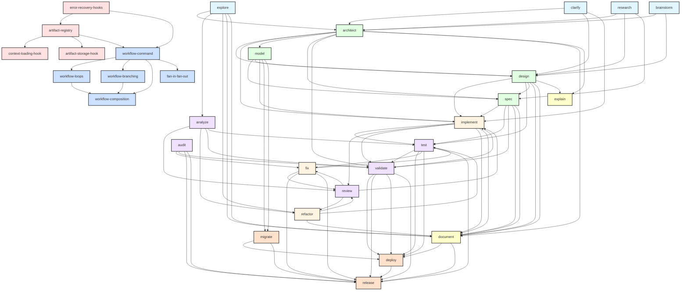
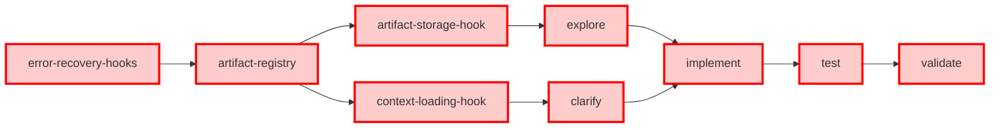
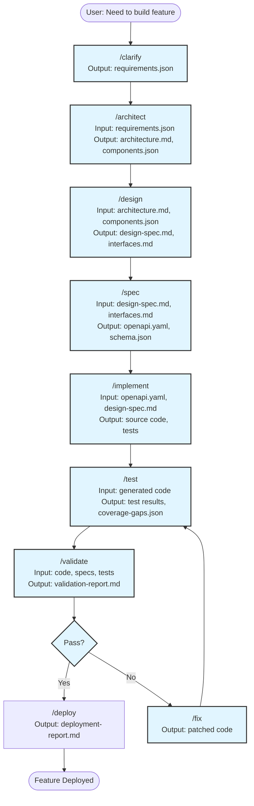

# Command Dependency Graph

**Created:** 2025-12-23
**Purpose:** Document dependency relationships, artifact flows, and implementation order for all dev workflow commands

---

## Overview

This document maps the complete dependency graph across 38 implementation plans, identifying:
- **Upstream dependencies**: Commands/artifacts that must exist before a command can run
- **Downstream consumers**: Commands that consume a command's output
- **Circular dependencies**: Potential circular relationships requiring careful ordering
- **Implementation waves**: Recommended implementation order based on dependencies

---

## Dependency Categories

### 1. Foundation Layer (No Dependencies)
Commands that have no upstream dependencies and provide core infrastructure:

- **explore** - Codebase discovery and mapping
- **clarify** - Requirements gathering through Socratic questioning
- **brainstorm** - Creative ideation and solution exploration
- **research** - Technology and pattern research

### 2. Core Infrastructure (P0)
Commands that provide essential infrastructure for other commands:

- **artifact-registry** - Artifact tracking and metadata management
- **error-recovery-hooks** - Error handling and recovery mechanisms
- **context-loading-hook** - Artifact consumption and context management
- **artifact-storage-hook** - Artifact persistence and versioning

### 3. Design & Architecture Layer
Commands that produce design artifacts:

- **architect** - System-level architecture design
- **design** - Component-level detailed design
- **spec** - Formal specifications (OpenAPI, JSON Schema, GraphQL, AsyncAPI)
- **model** - Data modeling and entity relationships

### 4. Implementation Layer
Commands that generate or modify code:

- **implement** - Code generation from specifications
- **refactor** - Code restructuring and improvement
- **fix** - Bug fixing and error resolution

### 5. Quality Assurance Layer
Commands that verify correctness:

- **test** - Test generation and execution
- **validate** - Specification and contract validation
- **review** - Code review and quality checks
- **analyze** - Static analysis and metrics
- **audit** - Compliance and security auditing

### 6. Documentation Layer
Commands that generate documentation:

- **document** - Comprehensive documentation generation
- **explain** - Focused explanations for understanding

### 7. Deployment Layer
Commands for release and deployment:

- **deploy** - Deployment automation
- **release** - Release management and versioning
- **migrate** - Migration and upgrade automation

### 8. Advanced Workflow Layer
Commands for complex workflows:

- **workflow-command** - Workflow orchestration
- **workflow-loops** - Iterative workflow patterns
- **workflow-branching** - Conditional workflow execution
- **workflow-composition** - Workflow combination and reuse
- **fan-in-fan-out** - Parallel workflow execution

### 9. Agent Layer
Specialized agents for complex tasks:

- **explore-agent** - Enhanced exploration agent
- **analyze-agent** - Deep analysis agent
- **review-agent** - Automated review agent
- **debug-agent** - Interactive debugging agent
- **deploy-agent** - Deployment automation agent

---

## Detailed Dependency Mapping

### Foundation Commands

#### /explore
**Artifact Type:** `exploration-report.md`, `codebase-map.json`, `architecture-map.json`

**Upstream Dependencies:**
- None (foundational command)

**Downstream Consumers:**
- `/clarify` - Uses exploration artifacts to identify clarification needs
- `/analyze` - Consumes exploration results for deep-dive analysis
- `/refactor` - Uses exploration data for refactoring planning
- `/document` - Generates documentation from exploration artifacts
- `/architect` - Leverages codebase-map.json for architecture decisions

**Priority:** P0 (CRITICAL - Discovery & Ideation)

---

#### /clarify
**Artifact Type:** `requirements.json`, `scope.md`, `constraints.json`, `acceptance-criteria.md`

**Upstream Dependencies:**
- None (typically first command in workflow)

**Downstream Consumers:**
- `/architect` - Consumes requirements.json for system architecture
- `/design` - Consumes requirements and scope for component design
- `/plan:create` - Uses clarification artifacts to generate implementation plans
- `/implement` - Uses requirements.json for feature implementation

**Priority:** P0 (CRITICAL - Discovery & Ideation)

---

#### /brainstorm
**Artifact Type:** `ideas.md`, `alternatives.md`, `comparison-matrix.md`, `architecture-options.md`

**Upstream Dependencies:**
- None (ideation command)

**Downstream Consumers:**
- `/architect` - Uses architecture-options.md and alternatives for decision-making
- `/design` - Uses solution alternatives for component design
- `/research` - Can inform research topics based on brainstormed ideas

**Priority:** P1 (Discovery & Ideation)

---

#### /research
**Artifact Type:** `technology-research.md`, `pattern-research.md`, `security-research.md`, `performance-research.md`

**Upstream Dependencies:**
- None (information gathering command)
- Optional: `/brainstorm` - Can inform research topics

**Downstream Consumers:**
- `/architect` - Uses technology research for ADRs and technology choices
- `/design` - Uses pattern research for design decisions
- `/spec` - Uses API/protocol research for specification format selection
- `/implement` - Uses research to guide technology selection

**Priority:** P0 (Discovery & Ideation)

---

### Design & Architecture Layer

#### /architect
**Artifact Type:** `architecture.md`, `components.json`, `ADR/NNNN-*.md`, `security-architecture.md`

**Upstream Dependencies:**
- `/clarify` - Provides requirements.json with functional and non-functional requirements
- `/research` - Provides technology research and evaluations
- `/brainstorm` - Provides architecture alternatives and options
- `/explore` - Provides existing codebase understanding via codebase-map.json

**Downstream Consumers:**
- `/design` - Consumes architecture.md and components.json for component-level design
- `/implement` - Consumes architecture for implementation guidance
- `/model` - Consumes data architecture for entity modeling
- `/spec` - Consumes component interfaces for API specification
- `/validate` - Validates architecture documents and decisions

**Priority:** P1 (Design & Architecture)

---

#### /design
**Artifact Type:** `design-spec.md`, `interfaces.md`, `interaction-diagrams.md`, `state-machine.json`

**Upstream Dependencies:**
- `/architect` - Provides architecture.md and components.json (RECOMMENDED)
- `/clarify` - Provides requirements input
- `/brainstorm` - Provides design alternatives

**Downstream Consumers:**
- `/implement` - Consumes design artifacts for code generation
- `/test` - Uses design specs for test generation
- `/spec` - Formalizes design into OpenAPI/JSON Schema
- `/document` - References design specifications

**Priority:** P1 (Design & Architecture)

---

#### /spec
**Artifact Type:** `openapi.yaml`, `schema.json`, `graphql.sdl`, `asyncapi.yaml`, `data-model.json`

**Upstream Dependencies:**
- `/clarify` - Provides requirements.json
- `/design` - Provides design-spec.md and interfaces.md
- `/architect` - Provides architecture.md for API structure
- `/model` - Provides entities.json for data specifications

**Downstream Consumers:**
- `/implement` - Consumes specifications for code generation
- `/test` - Uses specifications for test case derivation
- `/validate` - Validates specifications
- `/document` - Uses specs as documentation seed

**Priority:** P1 (Design & Architecture)

---

#### /model
**Artifact Type:** `entities.json`, `erd.md`, `data-dictionary.md`

**Upstream Dependencies:**
- `/architect` - Provides data architecture for entity identification
- `/clarify` - Provides data requirements

**Downstream Consumers:**
- `/spec` - Uses entities for data model specifications
- `/design` - Uses entity models for component design
- `/implement` - Uses entities for ORM/database code generation
- `/migrate` - Uses entity changes for migration generation

**Priority:** P1 (Design & Architecture)

---

### Implementation Layer

#### /implement
**Artifact Type:** `implementation-notes.md`, `generated-code-manifest.json`, source files, test files

**Upstream Dependencies:**
- `/design` - Provides design-spec.md (RECOMMENDED)
- `/spec` - Provides openapi.yaml, schema.json for code generation
- `/clarify` - Provides requirements.json
- `/architect` - Provides architecture guidance

**Downstream Consumers:**
- `/test` - Tests the generated code
- `/review` - Reviews generated code
- `/validate` - Validates generated code
- `/document` - Documents generated APIs and components

**Priority:** P0 (CRITICAL - Implementation)

---

#### /refactor
**Artifact Type:** `refactoring-plan.md`, `before-after.md`, refactored source files

**Upstream Dependencies:**
- `/explore` - Provides codebase understanding
- `/analyze` - Provides code smells and complexity metrics
- `/review` - Provides refactoring suggestions

**Downstream Consumers:**
- `/test` - Verifies refactoring didn't break functionality
- `/review` - Reviews refactored code
- `/document` - Updates documentation after refactoring

**Priority:** P1 (Implementation)

---

#### /fix
**Artifact Type:** `bug-analysis.md`, `fix-notes.md`, patched source files

**Upstream Dependencies:**
- `/test` - Provides test failures to fix
- `/analyze` - Provides bug detection results
- `/debug` - Provides debugging insights
- `/review` - Identifies bugs in review

**Downstream Consumers:**
- `/test` - Verifies fix resolves issue
- `/review` - Reviews fix quality
- `/release` - Includes fix in release notes

**Priority:** P0 (Implementation)

---

### Quality Assurance Layer

#### /test
**Artifact Type:** `test-plan.md`, `test-matrix.json`, `coverage-gaps.json`, test files

**Upstream Dependencies:**
- `/spec` - Uses specifications for test case derivation
- `/design` - Uses component designs for integration tests
- `/implement` - Tests the code generated by implement command
- `/analyze` - Uses coverage gaps from analysis for test prioritization

**Downstream Consumers:**
- `/validate` - Test results feed into validation reports
- `/review` - Test coverage informs code review quality checks
- `/deploy` - Test passage required for deployment gates
- `/fix` - Test failures trigger bug fixes

**Priority:** P0 (CRITICAL - Quality)

---

#### /validate
**Artifact Type:** `validation-report.md`, `deviations.json`, `traceability-matrix.md`

**Upstream Dependencies:**
- `/spec` - Validates specifications created by spec command
- `/architect` - Validates architecture documents and decisions
- `/design` - Validates component designs and interfaces
- `/analyze` - Uses analysis metrics for validation thresholds
- `/test` - Uses test results for validation

**Downstream Consumers:**
- `/implement` - Blocked by validation failures
- `/deploy` - Uses validation status for deployment gates
- `/release` - Requires passing validation for release

**Priority:** P0 (CRITICAL - Quality)

---

#### /review
**Artifact Type:** `review-comments.md`, `suggestions.json`, `merge-blockers.md`

**Upstream Dependencies:**
- `/explore` - Uses codebase understanding for context-aware reviews
- `/analyze` - Consumes analysis findings to inform review comments
- Project coding standards (ESLint, Prettier configs)

**Downstream Consumers:**
- `/fix` - Generates fixes based on review suggestions
- `/implement` - Uses review feedback to guide implementation changes
- `/refactor` - Uses review findings for refactoring priorities

**Priority:** P0 (Quality)

---

#### /analyze
**Artifact Type:** `analysis-report.json`, `metrics-summary.md`, `code-smells.json`

**Upstream Dependencies:**
- `/explore` - Uses exploration data for baseline understanding
- `/test` - Uses test coverage for analysis context

**Downstream Consumers:**
- `/review` - Uses analysis findings to inform reviews
- `/refactor` - Uses code smells for refactoring priorities
- `/validate` - Uses metrics for validation thresholds
- `/test` - Uses coverage gaps for test prioritization

**Priority:** P0 (Quality)

---

#### /audit
**Artifact Type:** `audit-report.md`, `compliance-matrix.json`, `security-findings.json`

**Upstream Dependencies:**
- `/analyze` - Uses analysis for security metrics
- `/spec` - Validates API security specifications
- `/architect` - Reviews security architecture

**Downstream Consumers:**
- `/fix` - Addresses security vulnerabilities
- `/validate` - Incorporates audit findings
- `/release` - Requires security sign-off

**Priority:** P1 (Quality)

---

### Documentation Layer

#### /document
**Artifact Type:** `api-docs.md`, `user-guide.md`, `architecture-docs.md`, `README.md`

**Upstream Dependencies:**
- `/architect` - Uses architecture.md for architecture docs
- `/design` - Uses design-spec.md for component docs
- `/spec` - Uses OpenAPI/GraphQL specs for API docs
- `/explore` - Uses exploration artifacts for codebase docs
- `/implement` - Documents generated APIs and components

**Downstream Consumers:**
- `/release` - Includes documentation in release
- `/deploy` - Deploys documentation to hosting

**Priority:** P1 (Documentation)

---

#### /explain
**Artifact Type:** `explanation.md`, `concept-guide.md`

**Upstream Dependencies:**
- `/explore` - Uses exploration for context
- `/architect` - Uses architecture for system explanations
- `/design` - Uses design specs for component explanations

**Downstream Consumers:**
- `/document` - Explanations feed into comprehensive docs
- Team onboarding and knowledge sharing

**Priority:** P2 (Documentation)

---

### Deployment Layer

#### /deploy
**Artifact Type:** `deployment-report.md`, `rollback-plan.md`

**Upstream Dependencies:**
- `/validate` - Requires passing validation
- `/test` - Requires passing tests
- `/architect` - Uses deployment architecture
- `/release` - Uses release artifacts

**Downstream Consumers:**
- `/release` - Deployment status feeds into release notes

**Priority:** P1 (Deployment)

---

#### /release
**Artifact Type:** `CHANGELOG.md`, `release-notes.md`, version bumps

**Upstream Dependencies:**
- `/validate` - Requires passing validation
- `/test` - Requires passing tests
- `/audit` - Requires security sign-off
- `/document` - Includes documentation
- `/fix` - Includes fixes in release notes

**Downstream Consumers:**
- `/deploy` - Uses release artifacts for deployment

**Priority:** P1 (Deployment)

---

#### /migrate
**Artifact Type:** `migration-plan.md`, `migration-scripts`, `rollback-scripts`

**Upstream Dependencies:**
- `/model` - Uses entity changes for migration generation
- `/validate` - Validates migration safety
- `/test` - Tests migration procedures

**Downstream Consumers:**
- `/deploy` - Executes migrations during deployment
- `/release` - Documents migrations in release notes

**Priority:** P1 (Deployment)

---

### Infrastructure Layer

#### /artifact-registry
**Artifact Type:** Registry metadata, artifact index

**Upstream Dependencies:**
- `/error-recovery-hooks` - Uses error handling for registry operations

**Downstream Consumers:**
- ALL commands - Provides artifact tracking and metadata management

**Priority:** P0 (CRITICAL - Infrastructure)

---

#### /error-recovery-hooks
**Artifact Type:** Error handling configuration, recovery procedures

**Upstream Dependencies:**
- None (foundational infrastructure)

**Downstream Consumers:**
- ALL commands - Provides error handling and recovery mechanisms

**Priority:** P0 (CRITICAL - Infrastructure)

---

#### /context-loading-hook
**Artifact Type:** Context configuration, artifact consumption rules

**Upstream Dependencies:**
- `/artifact-registry` - Uses registry for artifact discovery

**Downstream Consumers:**
- ALL commands - Provides artifact consumption and context management

**Priority:** P0 (Infrastructure)

---

#### /artifact-storage-hook
**Artifact Type:** Storage configuration, versioning rules

**Upstream Dependencies:**
- `/artifact-registry` - Integrates with registry for metadata

**Downstream Consumers:**
- ALL commands - Provides artifact persistence and versioning

**Priority:** P0 (Infrastructure)

---

#### /notification-hooks
**Artifact Type:** Notification configuration, alert rules

**Upstream Dependencies:**
- None (infrastructure utility)

**Downstream Consumers:**
- ALL commands - Provides notifications for command events

**Priority:** P2 (Infrastructure)

---

### Workflow Layer

#### /workflow-command
**Artifact Type:** Workflow definitions, execution logs

**Upstream Dependencies:**
- `/artifact-registry` - Tracks workflow artifacts
- `/error-recovery-hooks` - Handles workflow failures

**Downstream Consumers:**
- Orchestrates execution of other commands

**Priority:** P1 (Workflow)

---

#### /workflow-loops
**Artifact Type:** Loop definitions, iteration state

**Upstream Dependencies:**
- `/workflow-command` - Extends base workflow capabilities

**Downstream Consumers:**
- Used by complex iterative workflows

**Priority:** P1 (Workflow)

---

#### /workflow-branching
**Artifact Type:** Branch definitions, condition evaluation

**Upstream Dependencies:**
- `/workflow-command` - Extends base workflow capabilities

**Downstream Consumers:**
- Used by conditional workflows

**Priority:** P0 (Workflow)

---

#### /workflow-composition
**Artifact Type:** Composed workflow definitions

**Upstream Dependencies:**
- `/workflow-command` - Extends base workflow capabilities
- `/workflow-loops` - Can compose loops
- `/workflow-branching` - Can compose branches

**Downstream Consumers:**
- Enables reusable workflow patterns

**Priority:** P1 (Workflow)

---

#### /fan-in-fan-out
**Artifact Type:** Parallel execution definitions, aggregation results

**Upstream Dependencies:**
- `/workflow-command` - Extends base workflow capabilities

**Downstream Consumers:**
- Used by parallel processing workflows

**Priority:** P1 (Workflow)

---

### Agent Layer

#### /explore-agent
**Artifact Type:** Enhanced exploration reports

**Upstream Dependencies:**
- `/explore` - Extends exploration capabilities

**Downstream Consumers:**
- Same as `/explore` command

**Priority:** P1 (Agent)

---

#### /analyze-agent
**Artifact Type:** Deep analysis reports

**Upstream Dependencies:**
- `/analyze` - Extends analysis capabilities
- `/explore` - Uses exploration context

**Downstream Consumers:**
- Same as `/analyze` command

**Priority:** P1 (Agent)

---

#### /review-agent
**Artifact Type:** Automated review reports

**Upstream Dependencies:**
- `/review` - Extends review capabilities
- `/analyze` - Uses analysis findings

**Downstream Consumers:**
- Same as `/review` command

**Priority:** P1 (Agent)

---

#### /debug-agent
**Artifact Type:** Debug session logs, fix suggestions

**Upstream Dependencies:**
- `/analyze` - Uses analysis for context
- `/test` - Uses test failures for debugging

**Downstream Consumers:**
- `/fix` - Provides debugging insights for fixes

**Priority:** P1 (Agent)

---

#### /deploy-agent
**Artifact Type:** Automated deployment reports

**Upstream Dependencies:**
- `/deploy` - Extends deployment capabilities
- `/validate` - Uses validation results

**Downstream Consumers:**
- `/release` - Provides deployment status

**Priority:** P1 (Agent)

---

## Circular Dependencies

### Identified Circular Relationships

1. **analyze ↔ test**
   - `/analyze` uses test coverage for analysis context
   - `/test` uses coverage gaps from analysis for test prioritization
   - **Resolution:** Break cycle by making analysis coverage-aware optional, test can run without analysis

2. **validate ↔ implement**
   - `/validate` can validate specs before implementation
   - `/implement` generates code that needs validation
   - **Resolution:** Validation occurs at two points: pre-implementation (spec validation) and post-implementation (code validation)

3. **review ↔ fix**
   - `/review` identifies issues that need fixing
   - `/fix` generates changes that need review
   - **Resolution:** Iterative cycle is intentional - represents standard development loop

4. **workflow-composition ↔ workflow-loops/branching**
   - `/workflow-composition` can compose loops and branches
   - Loops and branches can contain composed workflows
   - **Resolution:** Limit nesting depth, implement cycle detection

### No Critical Blocking Cycles

All identified circular relationships are either:
- **Intentional iterative loops** (review → fix → review)
- **Optional enhancements** (analyze ↔ test)
- **Multi-phase usage** (validate pre/post implementation)
- **Controlled composition** (workflows with cycle detection)

---

## Implementation Order

### Wave 1: Foundation Infrastructure (P0 - Critical Path)
**Duration:** 2-3 weeks
**Dependencies:** None

1. `/error-recovery-hooks` - Error handling infrastructure
2. `/artifact-registry` - Artifact tracking system
3. `/artifact-storage-hook` - Artifact persistence
4. `/context-loading-hook` - Context management

**Rationale:** These provide essential infrastructure that all other commands depend on.

---

### Wave 2: Discovery & Planning (P0 - Critical for Workflow Start)
**Duration:** 3-4 weeks
**Dependencies:** Wave 1

5. `/explore` - Codebase discovery
6. `/clarify` - Requirements gathering
7. `/research` - Technology research
8. `/brainstorm` - Ideation (can be P1 if time-constrained)

**Rationale:** These are entry points for workflows and have no command dependencies.

---

### Wave 3: Design & Architecture (P1 - Design Phase)
**Duration:** 4-5 weeks
**Dependencies:** Wave 2

9. `/architect` - System architecture
10. `/model` - Data modeling
11. `/design` - Component design
12. `/spec` - Formal specifications

**Rationale:** These consume discovery artifacts and produce design artifacts for implementation.

---

### Wave 4: Core Implementation & Quality (P0 - Critical for Development)
**Duration:** 5-6 weeks
**Dependencies:** Wave 3

13. `/implement` - Code generation
14. `/test` - Test generation and execution
15. `/validate` - Specification validation
16. `/analyze` - Code analysis

**Rationale:** Core development workflow commands that enable code creation and quality verification.

---

### Wave 5: Quality & Review (P1 - Quality Enhancement)
**Duration:** 3-4 weeks
**Dependencies:** Wave 4

17. `/review` - Code review
18. `/audit` - Compliance auditing
19. `/fix` - Bug fixing
20. `/refactor` - Code refactoring

**Rationale:** Enhanced quality and improvement commands.

---

### Wave 6: Documentation & Deployment (P1 - Release Preparation)
**Duration:** 3-4 weeks
**Dependencies:** Wave 4, Wave 5

21. `/document` - Documentation generation
22. `/explain` - Explanations
23. `/deploy` - Deployment automation
24. `/migrate` - Migration tools
25. `/release` - Release management

**Rationale:** Commands for release preparation and deployment.

---

### Wave 7: Workflow Orchestration (P1 - Advanced Features)
**Duration:** 4-5 weeks
**Dependencies:** Wave 1-6

26. `/workflow-command` - Base workflow orchestration
27. `/workflow-branching` - Conditional workflows
28. `/workflow-loops` - Iterative workflows
29. `/workflow-composition` - Workflow reuse
30. `/fan-in-fan-out` - Parallel execution

**Rationale:** Advanced workflow features depend on having functional commands to orchestrate.

---

### Wave 8: Specialized Agents (P2 - Enhancements)
**Duration:** 3-4 weeks
**Dependencies:** Corresponding base commands

31. `/explore-agent` - Enhanced exploration
32. `/analyze-agent` - Deep analysis
33. `/review-agent` - Automated reviews
34. `/debug-agent` - Interactive debugging
35. `/deploy-agent` - Deployment automation

**Rationale:** Agents enhance existing commands and can be implemented incrementally.

---

### Wave 9: Advanced Hooks (P2 - Optional Enhancements)
**Duration:** 1-2 weeks
**Dependencies:** Wave 1

36. `/notification-hooks` - Event notifications

**Rationale:** Nice-to-have infrastructure enhancements.

---

## Implementation Timeline

```
Total Waves: 9
Total Duration: 28-37 weeks (~7-9 months)

Critical Path (P0 only):
- Wave 1: Foundation Infrastructure (2-3 weeks)
- Wave 2: Discovery (3-4 weeks, excluding brainstorm)
- Wave 4: Core Implementation & Quality (5-6 weeks)

Minimum Viable System: ~10-13 weeks (Waves 1, 2, 4)
Full System with P1: ~28-37 weeks (all waves)
```

---

## Mermaid Dependency Diagram

### High-Level Command Flow



### Critical Path for Minimum Viable System



### Artifact Flow Example: Feature Implementation



---

## Key Findings

### 1. Clean Dependency Hierarchy
The command system has a well-structured dependency hierarchy with minimal circular dependencies. Most relationships flow in one direction: Discovery → Design → Implementation → Quality → Deployment.

### 2. Foundation Infrastructure is Critical
The artifact registry and error recovery hooks are foundational and must be implemented first, as nearly all other commands depend on them.

### 3. Multiple Entry Points
The system supports multiple workflow entry points:
- **Greenfield projects:** Start with `/clarify` or `/brainstorm`
- **Existing codebases:** Start with `/explore`
- **Research-first:** Start with `/research`
- **Emergency fixes:** Start with `/debug` or `/fix`

### 4. Strong Quality Focus
Quality commands (test, validate, review, analyze, audit) form a tightly interconnected cluster, enabling comprehensive quality assurance.

### 5. Iterative Development Cycles
Several intentional cycles support iterative development:
- **Fix cycle:** review → fix → test → review
- **Refactor cycle:** analyze → refactor → test → review
- **Design cycle:** design → implement → review → design

### 6. Agent Layer is Orthogonal
Agents enhance base commands but don't create new dependencies, making them good candidates for incremental enhancement after core features stabilize.

### 7. Workflow Commands Enable Automation
The workflow layer (workflow-command, loops, branching, composition, fan-in-fan-out) sits atop all other commands, enabling automation of complex multi-command workflows.

---

## Recommended Implementation Strategy

### Phase 1: MVP (10-13 weeks)
Focus on critical path commands for basic workflow support:
- **Wave 1:** Infrastructure (errors, registry, storage, context)
- **Wave 2:** Discovery (explore, clarify, research)
- **Wave 4:** Core Implementation (implement, test, validate)

**Outcome:** Can execute basic discover → implement → test → validate workflow

### Phase 2: Enhanced Development (18-24 weeks cumulative)
Add design phase and quality commands:
- **Wave 3:** Design & Architecture (architect, design, spec, model)
- **Wave 5:** Quality & Review (review, audit, fix, refactor)

**Outcome:** Full development lifecycle with design phase and code review

### Phase 3: Production Ready (28-37 weeks cumulative)
Add deployment and documentation:
- **Wave 6:** Documentation & Deployment (document, explain, deploy, migrate, release)
- **Wave 7:** Workflow Orchestration (workflow commands)

**Outcome:** Production-ready system with automated workflows

### Phase 4: Advanced Features (Optional)
Add enhancements and agents:
- **Wave 8:** Specialized Agents
- **Wave 9:** Advanced Hooks

**Outcome:** Enhanced capabilities for complex scenarios

---

## Maintenance Considerations

### Dependency Updates
When modifying a command's output artifacts:
1. Check this dependency graph for downstream consumers
2. Update artifact schemas with backwards compatibility
3. Add migration paths for breaking changes
4. Update all consuming commands' documentation

### Adding New Commands
When adding a new command:
1. Identify upstream dependencies (what artifacts does it consume?)
2. Define output artifacts (what does it produce?)
3. Identify downstream consumers (who will use your artifacts?)
4. Update this dependency graph
5. Determine appropriate implementation wave

### Breaking Circular Dependencies
If a new circular dependency is introduced:
1. Identify if it's intentional (iterative cycle) or accidental
2. For accidental cycles: Make one dependency optional or use versioning
3. For intentional cycles: Add cycle detection and depth limits
4. Document the cycle and its resolution strategy

---

## Version History

- **v1.0** (2025-12-23): Initial dependency graph creation with 38 implementation plans mapped
