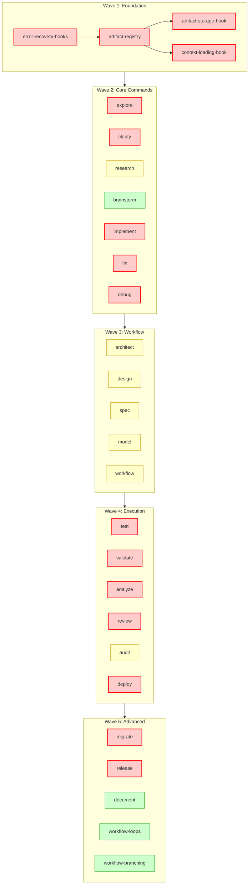

# Implementation Roadmap

**Created:** 2025-12-24
**Purpose:** Define implementation waves for all 38 implementation plans based on dependency relationships

---

## Overview

This roadmap organizes the 38 implementation plans into 5 waves based on:
1. **Dependencies** - Commands can only be implemented after their dependencies
2. **Priority** - P0 commands are prioritized within each wave
3. **Cohesion** - Related commands are grouped for efficient implementation
4. **Critical Path** - Foundation infrastructure enables all subsequent work

---

## Wave Summary

| Wave | Name | Commands | Priority Focus |
|------|------|----------|----------------|
| 1 | Foundation | 4 | P0 Infrastructure |
| 2 | Core Commands | 8 | P0 Discovery + Implementation |
| 3 | Workflow Commands | 6 | P0/P1 Design + Architecture |
| 4 | Execution Commands | 10 | P0 Quality + Deployment |
| 5 | Advanced Features | 10 | P1/P2 Workflows + Agents |

**Total: 38 implementation plans**

---

## Wave 1: Foundation (4 commands)

**Focus:** Essential infrastructure that all other commands depend on.

**Must be completed first - blocks all subsequent waves.**

| # | Command | Plan File | Priority | Dependencies |
|---|---------|-----------|----------|--------------|
| 1 | error-recovery-hooks | implement-error-recovery-hooks.md | P0 | None |
| 2 | artifact-registry | implement-artifact-registry.md | P0 | error-recovery-hooks |
| 3 | artifact-storage-hook | implement-artifact-storage-hook.md | P0 | artifact-registry |
| 4 | context-loading-hook | implement-context-loading-hook.md | P0 | artifact-registry |

**Completion Criteria:**
- [ ] Error classification and recovery framework operational
- [ ] Artifact registry can track and retrieve artifacts
- [ ] Artifacts automatically persisted after commands
- [ ] Context loading injects relevant artifacts before commands

---

## Wave 2: Core Commands (8 commands)

**Focus:** Entry points for workflows (discovery, ideation) and core implementation.

**Depends on Wave 1 infrastructure.**

| # | Command | Plan File | Priority | Dependencies |
|---|---------|-----------|----------|--------------|
| 5 | explore-command | implement-explore-command.md | P0 | Wave 1 |
| 6 | explore-agent | implement-explore-agent.md | P0 | explore-command |
| 7 | clarify-command | implement-clarify-command.md | P0 | Wave 1 |
| 8 | research-command | implement-research-command.md | P0 | Wave 1 |
| 9 | brainstorm-command | implement-brainstorm-command.md | P1 | Wave 1 |
| 10 | implement-command | implement-implement-command.md | P0 | clarify-command |
| 11 | fix-command | implement-fix-command.md | P0 | explore-command |
| 12 | debug-command | implement-debug-command.md | P0 | explore-command |

**Completion Criteria:**
- [ ] Codebase exploration and mapping functional
- [ ] Requirements gathering via Socratic questioning
- [ ] Technology research and ideation available
- [ ] Basic code generation from specifications
- [ ] Bug fixing and debugging workflows operational

---

## Wave 3: Workflow Commands (6 commands)

**Focus:** Design and architecture layer for structured development.

**Depends on Wave 2 discovery commands.**

| # | Command | Plan File | Priority | Dependencies |
|---|---------|-----------|----------|--------------|
| 13 | architect-command | implement-architect-command.md | P1 | clarify, explore, research |
| 14 | design-command | implement-design-command.md | P1 | architect-command |
| 15 | spec-command | implement-spec-command.md | P1 | design-command |
| 16 | model-command | implement-model-command.md | P1 | architect-command |
| 17 | template-command | implement-template-command.md | P1 | Wave 1 |
| 18 | workflow-command | implement-workflow-command.md | P0 | artifact-registry, error-recovery |

**Completion Criteria:**
- [ ] System architecture design with ADRs
- [ ] Component-level design specifications
- [ ] OpenAPI/GraphQL/AsyncAPI spec generation
- [ ] Data modeling and entity relationships
- [ ] Template system for plan creation
- [ ] Base workflow orchestration framework

---

## Wave 4: Execution Commands (10 commands)

**Focus:** Quality assurance, deployment, and operations.

**Depends on Wave 3 design commands.**

| # | Command | Plan File | Priority | Dependencies |
|---|---------|-----------|----------|--------------|
| 19 | test-command | implement-test-command.md | P0 | spec-command, implement-command |
| 20 | validate-command | implement-validate-command.md | P0 | spec-command, architect-command |
| 21 | analyze-command | implement-analyze-command.md | P0 | explore-command |
| 22 | analyze-agent | implement-analyze-agent.md | P0 | analyze-command |
| 23 | review-command | implement-review-command.md | P0 | analyze-command |
| 24 | review-agent | implement-review-agent.md | P0 | review-command |
| 25 | audit-command | implement-audit-command.md | P1 | analyze-command |
| 26 | refactor-command | implement-refactor-command.md | P1 | analyze-command, review-command |
| 27 | debug-agent | implement-debug-agent.md | P0 | debug-command |
| 28 | deploy-command | implement-deploy-command.md | P0 | validate-command, test-command |

**Completion Criteria:**
- [ ] Test generation and execution
- [ ] Specification and contract validation
- [ ] Static analysis and metrics
- [ ] Code review automation
- [ ] Compliance and security auditing
- [ ] Deployment automation

---

## Wave 5: Advanced Features (10 commands)

**Focus:** Workflow extensions, documentation, and specialized features.

**Depends on Wave 4 core features.**

| # | Command | Plan File | Priority | Dependencies |
|---|---------|-----------|----------|--------------|
| 29 | deploy-agent | implement-deploy-agent.md | P0 | deploy-command |
| 30 | migrate-command | implement-migrate-command.md | P0 | model-command, validate-command |
| 31 | release-command | implement-release-command.md | P0 | validate-command, test-command |
| 32 | document-command | implement-document-command.md | P2 | architect, design, spec |
| 33 | explain-command | implement-explain-command.md | P2 | explore, architect |
| 34 | workflow-loops | implement-workflow-loops.md | P1 | workflow-command |
| 35 | workflow-branching | implement-workflow-branching.md | P1 | workflow-command |
| 36 | workflow-composition | implement-workflow-composition.md | P2 | workflow-loops, workflow-branching |
| 37 | fan-in-fan-out | implement-fan-in-fan-out.md | P2 | workflow-command |
| 38 | notification-hooks | implement-notification-hooks.md | P2 | Wave 1 |

**Completion Criteria:**
- [ ] Migration and upgrade automation
- [ ] Release management and versioning
- [ ] Documentation generation
- [ ] Advanced workflow patterns (loops, branching, composition)
- [ ] Parallel execution patterns
- [ ] Event notifications

---

## Critical Path

The minimum viable system (MVP) requires:

```
Wave 1 (Full)
    ↓
Wave 2 (P0 only: explore, clarify, implement, fix, debug)
    ↓
Wave 4 (P0 only: test, validate, analyze)
```

**MVP Commands (13):**
1. error-recovery-hooks
2. artifact-registry
3. artifact-storage-hook
4. context-loading-hook
5. explore-command
6. clarify-command
7. implement-command
8. fix-command
9. debug-command
10. test-command
11. validate-command
12. analyze-command
13. review-command

---

## Dependency Visualization



---

## Wave Ordering Rationale

### Why This Order?

1. **Wave 1 First:** All commands need artifact tracking and error recovery. Without this infrastructure, no command can persist or consume artifacts reliably.

2. **Wave 2 Second:** Discovery commands (explore, clarify) are entry points for most workflows. Implementation commands (implement, fix, debug) are the core user-facing actions.

3. **Wave 3 Third:** Design commands (architect, design, spec) require discovery artifacts and produce the specifications that implementation uses.

4. **Wave 4 Fourth:** Quality commands (test, validate, analyze) verify the work done by implementation commands.

5. **Wave 5 Last:** Advanced features (workflows, documentation) enhance the core capabilities but aren't blocking.

### Flexibility

While waves must be completed in order, commands within a wave can be parallelized where dependencies allow:

- **Wave 2:** explore, clarify, research can run in parallel
- **Wave 3:** architect must come before design → spec
- **Wave 4:** analyze can run in parallel with test/validate
- **Wave 5:** Most commands can be parallelized

---

## Version History

- **v1.0** (2025-12-24): Initial roadmap creation with 38 plans in 5 waves
