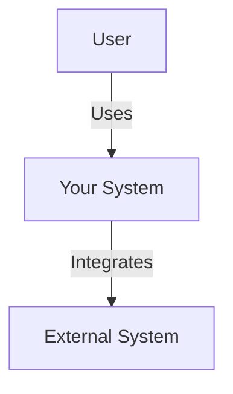
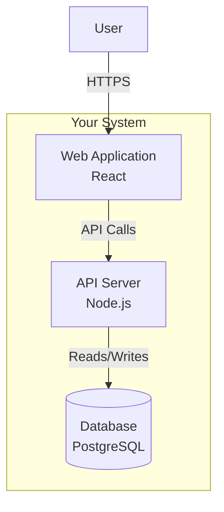
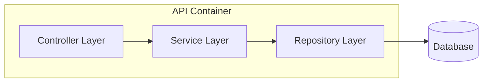

# /architect Command Design Specification

**Task:** 5.1 Design `/architect` command (system architecture)
**Category:** Design & Architecture
**Priority:** HIGH
**Date:** 2025-12-20

---

## Executive Summary

The `/architect` command provides system-level and high-level architecture design capabilities. It helps developers create comprehensive architecture documentation for systems, applications, or significant features by transforming requirements into structured architectural artifacts including C4 diagrams, component specifications, and architectural decision records (ADRs).

**Key Differentiator:** `/architect` operates at the **system boundary level** - defining how major components interact, data flows, deployment architecture, and cross-cutting concerns. It's the "big picture" command, in contrast to `/design` which handles individual component internals.

---

## Command Structure

### Primary Command: `/architect`

**Base invocation** (without sub-command):
```
/architect [optional-system-or-feature]
```

Starts intelligent architecture design session with context-aware sub-command routing.

### Sub-Commands

| Sub-command | Purpose | Output Artifact | Priority |
|-------------|---------|-----------------|----------|
| `architect:system` | System-level architecture (C4 Context/Container) | `architecture.md`, `system-diagram.md` | P0 |
| `architect:components` | Component decomposition and relationships | `components.json`, `component-diagram.md` | P0 |
| `architect:data` | Data architecture and flows | `data-architecture.md`, `data-flow.md` | P1 |
| `architect:deployment` | Deployment architecture and infrastructure | `deployment.md`, `infrastructure.md` | P1 |
| `architect:adr` | Architectural Decision Records | `adr/NNNN-decision-name.md` | P1 |
| `architect:security` | Security architecture and controls | `security-architecture.md` | P2 |

---

## YAML Frontmatter Specification

### Primary Command: `.claude/commands/architect.md`

```yaml
---
name: architect
description: System-level architecture design and documentation. Use for high-level component relationships, system boundaries, and architectural decisions.
model: sonnet
allowed-tools: Read, Write, Grep, Glob, Bash, AskUserQuestion
argument-hint: [system-or-feature-name]
---
```

### Sub-Commands

#### `.claude/commands/architect/system.md`

```yaml
---
name: architect:system
description: Design system-level architecture with C4 Context and Container diagrams
model: sonnet
allowed-tools: Read, Write, Grep, Glob, Bash, AskUserQuestion
argument-hint: [system-name]
---
```

#### `.claude/commands/architect/components.md`

```yaml
---
name: architect:components
description: Decompose system into components and define their relationships
model: sonnet
allowed-tools: Read, Write, Grep, Glob, Bash
argument-hint: [system-or-layer]
---
```

#### `.claude/commands/architect/data.md`

```yaml
---
name: architect:data
description: Design data architecture, storage patterns, and data flows
model: sonnet
allowed-tools: Read, Write, Grep, Glob, Bash
argument-hint: [scope]
---
```

#### `.claude/commands/architect/deployment.md`

```yaml
---
name: architect:deployment
description: Design deployment architecture and infrastructure topology
model: sonnet
allowed-tools: Read, Write, Grep, Glob, Bash, AskUserQuestion
argument-hint: [environment]
---
```

#### `.claude/commands/architect/adr.md`

```yaml
---
name: architect:adr
description: Create Architectural Decision Record documenting key decisions
model: sonnet
allowed-tools: Read, Write, Grep, Glob
argument-hint: [decision-topic]
---
```

#### `.claude/commands/architect/security.md`

```yaml
---
name: architect:security
description: Design security architecture, threat model, and security controls
model: sonnet
allowed-tools: Read, Write, Grep, Glob, Bash, AskUserQuestion
argument-hint: [scope]
---
```

---

## Output Location

All artifacts go to `docs/architecture/` with organized subdirectories:

```
docs/architecture/
├── architecture.md              # Main architecture document
├── system-diagram.md            # C4 Context + Container diagrams
├── components.json              # Structured component catalog
├── component-diagram.md         # Component-level diagrams
├── data-architecture.md         # Data architecture
├── data-flow.md                # Data flow diagrams
├── deployment.md               # Deployment architecture
├── infrastructure.md           # Infrastructure specifications
├── security-architecture.md    # Security design
└── adr/                        # Architectural Decision Records
    ├── 0001-technology-stack.md
    ├── 0002-data-storage.md
    └── template.md
```

---

## Artifact Schemas

### architecture.md Template

```markdown
---
type: architecture-document
system: [system-name]
version: 1.0.0
created: [ISO-date]
author: Claude Sonnet 4.5
status: draft|review|approved
---

# Architecture: [System Name]

## 1. Context & Goals

### Problem Statement
[What problem does this system solve?]

### Key Requirements
- [Requirement 1]
- [Requirement 2]

### Quality Attributes
| Attribute | Target | Priority |
|-----------|--------|----------|
| Performance | < 200ms p95 | High |
| Scalability | 10k concurrent users | Medium |
| Availability | 99.9% uptime | High |

## 2. System Overview

[2-3 paragraph high-level description]

### System Context

[Describe external dependencies, users, systems]

See `system-diagram.md` for visual representation.

## 3. Container Architecture

### Containers

| Container | Technology | Responsibility |
|-----------|-----------|----------------|
| Web App | React 18 | User interface |
| API Server | Node.js/Express | Business logic |
| Database | PostgreSQL 15 | Data persistence |

### Container Interactions

[Describe how containers communicate]

## 4. Component Architecture

### Components by Container

**API Server Components:**
- Authentication Service
- Business Logic Layer
- Data Access Layer

See `components.json` for detailed component catalog.

## 5. Data Architecture

### Data Stores

| Store | Type | Purpose |
|-------|------|---------|
| Primary DB | PostgreSQL | Transactional data |
| Cache | Redis | Session/performance |

### Data Flow

See `data-flow.md` for detailed data flow diagrams.

## 6. Cross-Cutting Concerns

### Security
[Security architecture approach]

### Error Handling
[Error handling strategy]

### Logging & Observability
[Logging, metrics, tracing approach]

### Configuration
[Configuration management approach]

## 7. Deployment Architecture

[Deployment topology overview]

## 8. Quality Attributes Analysis

### Performance
- **Target:** < 200ms p95 latency
- **Approach:** Caching, database indexing, async processing

### Scalability
- **Target:** 10k concurrent users
- **Approach:** Horizontal scaling, load balancing, stateless design

### Security
- **Authentication:** JWT tokens
- **Authorization:** RBAC
- **Data Protection:** Encryption at rest and in transit

### Reliability
- **Target:** 99.9% availability
- **Approach:** Health checks, circuit breakers, graceful degradation

## 9. Technology Choices

| Decision | Technology | Rationale |
|----------|-----------|-----------|
| Frontend | React 18 | Team expertise, ecosystem |
| Backend | Node.js | JavaScript across stack |
| Database | PostgreSQL | ACID, JSON support, maturity |

## 10. Constraints & Trade-offs

### Technical Constraints
- Must integrate with existing legacy API
- Limited to AWS infrastructure

### Trade-offs Made
- **Consistency vs Availability:** Chose eventual consistency for analytics
- **Monolith vs Microservices:** Started with modular monolith for simplicity

## 11. Risks & Mitigations

| Risk | Impact | Probability | Mitigation |
|------|--------|-------------|------------|
| Database bottleneck | High | Medium | Read replicas, caching |
| Third-party API failure | Medium | Low | Circuit breaker, fallback |

## 12. Future Considerations

### Evolution Path
- Phase 1 (Current): Modular monolith
- Phase 2: Extract analytics service
- Phase 3: Event-driven architecture

### Known Limitations
- Single database limits horizontal scaling
- Synchronous API calls impact latency
```

### components.json Schema

```json
{
  "metadata": {
    "system": "system-name",
    "version": "1.0.0",
    "created": "2025-12-20T00:00:00Z",
    "last_updated": "2025-12-20T00:00:00Z"
  },
  "containers": [
    {
      "id": "api-server",
      "name": "API Server",
      "technology": "Node.js/Express",
      "type": "application",
      "responsibility": "Business logic and data access",
      "components": [
        {
          "id": "auth-service",
          "name": "Authentication Service",
          "type": "service",
          "responsibility": "User authentication and session management",
          "interfaces": {
            "provides": [
              {
                "name": "login",
                "type": "REST",
                "endpoint": "POST /auth/login"
              }
            ],
            "consumes": [
              {
                "name": "user-repository",
                "type": "internal"
              }
            ]
          },
          "dependencies": [
            "user-repository",
            "token-service"
          ]
        }
      ]
    }
  ],
  "relationships": [
    {
      "source": "auth-service",
      "target": "user-repository",
      "type": "uses",
      "protocol": "function-call",
      "description": "Fetches user credentials for validation"
    }
  ],
  "external_dependencies": [
    {
      "id": "legacy-api",
      "name": "Legacy Customer API",
      "type": "external-system",
      "protocol": "REST/SOAP",
      "relationship": "integrates-with"
    }
  ]
}
```

### ADR Template (adr/template.md)

```markdown
# ADR-NNNN: [Decision Title]

**Status:** proposed | accepted | deprecated | superseded

**Date:** YYYY-MM-DD

**Deciders:** [List of people involved in decision]

---

## Context

[Describe the context and problem statement. What forces are at play?]

### Requirements
- [Requirement 1]
- [Requirement 2]

### Constraints
- [Constraint 1]
- [Constraint 2]

## Decision Drivers

- [Driver 1: e.g., "Must support 10k concurrent users"]
- [Driver 2: e.g., "Team has limited DevOps experience"]

## Options Considered

### Option 1: [Name]

**Description:** [Brief description]

**Pros:**
- [Pro 1]
- [Pro 2]

**Cons:**
- [Con 1]
- [Con 2]

### Option 2: [Name]

**Description:** [Brief description]

**Pros:**
- [Pro 1]

**Cons:**
- [Con 1]

## Decision

**Chosen Option:** [Option name]

**Rationale:** [Explain why this option was selected]

## Consequences

### Positive
- [Positive consequence 1]

### Negative
- [Negative consequence 1]

## Implementation Notes

- [Implementation detail 1]

## References

- [Reference 1]
```

---

## Workflow Integration

### Upstream Commands (Inputs)

| Artifact | Source Command | Purpose |
|----------|---------------|---------|
| `requirements.json` | `/clarify:requirements` | Functional/non-functional requirements |
| `constraints.json` | `/clarify:constraints` | Technical and business constraints |
| `codebase-map.json` | `/explore:architecture` | Existing architecture understanding |
| `research-notes.md` | `/research:technology` | Technology evaluation |
| `options-analysis.md` | `/research:patterns` | Pattern research |
| `architecture-options.md` | `/brainstorm:architecture` | Architecture alternatives |

### Downstream Commands (Outputs)

| Artifact | Consumed By | Purpose |
|----------|-------------|---------|
| `architecture.md` | `/design` | Component design input |
| `components.json` | `/design`, `/implement` | Component specifications |
| `data-architecture.md` | `/model` | Data model design |
| `security-architecture.md` | `/analyze:security` | Security validation |
| `adr/*.md` | All commands | Decision context |

---

## Mermaid Diagram Guidelines

### C4 Context Diagram


### C4 Container Diagram


### Component Diagram


---

## Example Usage

### Example 1: New System Architecture

```
User: /architect e-commerce-platform

Claude: I'll help design the architecture for the e-commerce platform.

First, let me check for existing artifacts...
[Searches for requirements.json, constraints.json, research-notes.md]

Found:
→ docs/clarify/requirements/e-commerce-2025-12-20.json
→ docs/research/technology-research.md (React, Node.js evaluation)

Based on the requirements, I'll design a system architecture. A few questions:

1. What's the expected scale? (concurrent users, orders per day)
2. Are there any existing systems we need to integrate with?
3. What are the deployment constraints? (cloud provider, budget)

[Interactive Q&A follows...]

Creating architecture artifacts:
→ docs/architecture/architecture.md
→ docs/architecture/system-diagram.md (C4 Context + Container)
→ docs/architecture/components.json
→ docs/architecture/adr/0001-microservices-vs-monolith.md
→ docs/architecture/adr/0002-database-choice.md

Recommended next steps:
- Run `/design` to design individual component internals
- Run `/architect:deployment` to plan infrastructure
- Run `/plan:create` to create implementation plan
```

---

## Quality Gates

Before marking architecture complete, verify:

- ✅ System context diagram exists (C4 Level 1)
- ✅ Container diagram exists (C4 Level 2)
- ✅ Component catalog in components.json
- ✅ All quality attributes addressed
- ✅ Cross-cutting concerns documented
- ✅ At least 2 ADRs for major decisions
- ✅ Technology choices justified
- ✅ Risks identified with mitigations
- ✅ Deployment approach outlined
- ✅ Integration points documented

---

## Differentiation from Related Commands

### `/architect` vs `/design`

| Aspect | `/architect` | `/design` |
|--------|-------------|----------|
| **Scope** | System-wide, cross-component | Single component/feature |
| **Level** | C4 Level 1-3 (System/Container/Component) | C4 Level 4 (Code) |
| **Focus** | Component relationships, system boundaries | Class design, algorithms, data structures |
| **Output** | architecture.md, system diagrams, ADRs | design-spec.md, interfaces.md, class diagrams |
| **Concerns** | Cross-cutting (security, logging, deployment) | Component-specific logic |

### `/architect` vs `/explore`

| Aspect | `/architect` | `/explore` |
|--------|-------------|----------|
| **Purpose** | Design new architecture | Understand existing architecture |
| **Direction** | Prescriptive (what should be) | Descriptive (what is) |
| **Output** | Design documents | Discovery maps |
| **Timing** | Before implementation | Before changes |

### `/architect` vs `/model`

| Aspect | `/architect` | `/model` |
|--------|-------------|----------|
| **Focus** | System components and topology | Data structures and relationships |
| **Output** | Component architecture | Entity-relationship diagrams, schemas |
| **Scope** | Full system | Data layer |

---

## References

- **C4 Model:** https://c4model.com/
- **ADR Template:** https://github.com/joelparkerhenderson/architecture-decision-record
- **Phase 4 Discovery Commands:** docs/plan-outputs/architecture-review/findings/04-discovery-commands.md
- **Phase 3 Features Review:** docs/plan-outputs/architecture-review/findings/03-features.md
