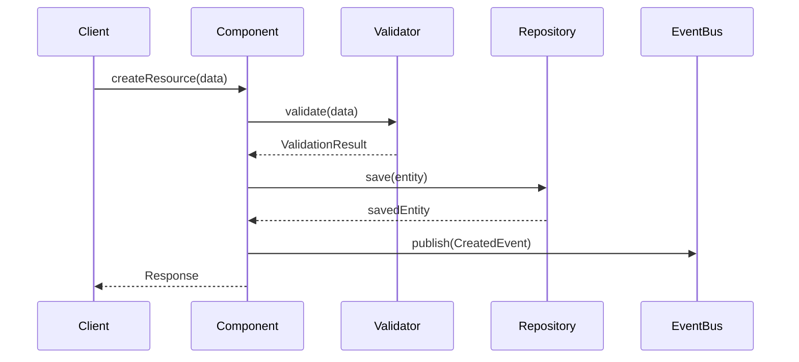
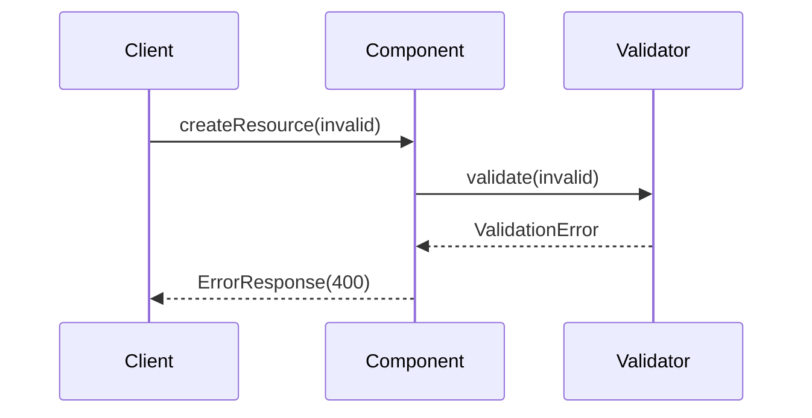
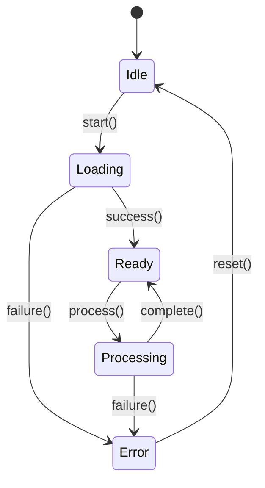

# Task 5.2: `/design` Command Design Specification

**Command Category:** Design & Architecture
**Priority:** CRITICAL
**Status:** Design Complete
**Date:** 2025-12-20

---

## Executive Summary

The `/design` command provides detailed component-level and feature-level design capabilities. It bridges the gap between high-level architecture (from `/architect`) and implementation (via `/implement`), creating implementation-ready specifications with well-defined interfaces, data structures, and interaction patterns.

**Key Differentiator:** Component-level detailed design with interface specifications, whereas `/architect` focuses on system-level architecture and `/spec` creates formal specifications.

**Key Features:**
- Component interface design with API contracts
- State management and data structure specifications
- Interaction pattern documentation with sequence diagrams
- Error handling and edge case design
- Integration point definitions
- Implementation-ready output artifacts

---

## Command Structure

### Primary Command: `/design`

**Base invocation** (without sub-command):
```
/design [component-or-feature-name]
```

Starts detailed design session for a specific component, module, or feature.

### Sub-Commands

| Sub-command | Purpose | Output Artifact | Priority |
|-------------|---------|-----------------|----------|
| `design:component` | Component internal design | `component-spec.md`, `interfaces.md` | P0 |
| `design:api` | API endpoint/interface design | `api-spec.md`, `openapi.yaml` | P0 |
| `design:data` | Data structure and schema design | `data-model.md`, `schemas.json` | P0 |
| `design:interactions` | Component interaction patterns | `interactions.md`, `sequence-diagrams.md` | P1 |
| `design:state` | State management design | `state-model.md`, `state-machine.json` | P1 |
| `design:ui` | UI component design | `ui-spec.md`, `component-tree.json` | P2 |

---

## YAML Frontmatter Specification

### Primary Command: `.claude/commands/design.md`

```yaml
---
name: design
description: Create detailed component and feature designs with interfaces, data structures, and interaction patterns. Use after architecture is defined to create implementation-ready specifications.
model: sonnet
allowed-tools: Read, Grep, Glob, Write, AskUserQuestion
argument-hint: [component-or-feature-name]
category: design-architecture
output_artifacts:
  - design-spec.md
  - interfaces.md
  - interaction-diagrams.md
---
```

### Sub-Commands

#### `.claude/commands/design/component.md`

```yaml
---
name: design:component
description: Design component internals including responsibilities, dependencies, interfaces, and internal structure
model: sonnet
allowed-tools: Read, Grep, Glob, Write, AskUserQuestion
argument-hint: [component-name]
---
```

#### `.claude/commands/design/api.md`

```yaml
---
name: design:api
description: Design API endpoints, interfaces, request/response formats, and contracts
model: sonnet
allowed-tools: Read, Grep, Glob, Write, AskUserQuestion
argument-hint: [api-name]
---
```

#### `.claude/commands/design/data.md`

```yaml
---
name: design:data
description: Design data structures, schemas, relationships, and validation rules
model: sonnet
allowed-tools: Read, Grep, Glob, Write, AskUserQuestion
argument-hint: [model-or-schema-name]
---
```

#### `.claude/commands/design/interactions.md`

```yaml
---
name: design:interactions
description: Design component interactions, message flows, and integration patterns
model: sonnet
allowed-tools: Read, Grep, Glob, Write, AskUserQuestion
argument-hint: [interaction-scope]
---
```

#### `.claude/commands/design/state.md`

```yaml
---
name: design:state
description: Design state management including state shape, transitions, and persistence
model: sonnet
allowed-tools: Read, Grep, Glob, Write, AskUserQuestion
argument-hint: [feature-or-component]
---
```

#### `.claude/commands/design/ui.md`

```yaml
---
name: design:ui
description: Design UI component hierarchy, props, events, and styling approach
model: sonnet
allowed-tools: Read, Grep, Glob, Write, AskUserQuestion
argument-hint: [ui-component-name]
---
```

---

## Model Configuration Rationale

**Model:** `sonnet` (Claude Sonnet 4.5)
- Balanced capability for detailed design work
- Strong at structured thinking and specification writing
- Cost-effective for medium-complexity tasks
- Sufficient for interface design and data modeling

**Allowed Tools:**
- `Read/Grep/Glob`: Analyze existing codebase patterns and conventions
- `Write`: Generate design artifacts
- `AskUserQuestion`: Clarify design decisions and constraints

**NOT Included:**
- `WebSearch/WebFetch`: Design should be based on requirements, not research (use `/research` first)
- `Bash`: Read-only analysis, no execution needed
- `Edit`: Generates new artifacts, doesn't edit existing files

---

## Output Location

All artifacts go to `docs/design/[component-name]/`:

```
docs/design/
├── authentication/
│   ├── design-spec.md
│   ├── interfaces.md
│   ├── interaction-diagrams.md
│   └── implementation-notes.md
├── user-profile/
│   ├── component-spec.md
│   ├── api-spec.md
│   ├── data-model.md
│   └── state-model.md
└── payment-processor/
    ├── design-spec.md
    ├── interfaces.md
    ├── error-handling.md
    └── sequence-diagrams.md
```

---

## Artifact Schemas

### design-spec.md Template

```markdown
---
artifact_type: design-specification
command: /design
component: [component-name]
version: 1.0.0
created_at: [ISO-8601]
status: draft
related_artifacts:
  - architecture.md
  - requirements.json
---

# Design Specification: [Component Name]

## Overview

### Purpose
What this component does and why it exists.

### Scope
What is included and excluded from this component.

### Context
How this fits into the overall system architecture.

## Responsibilities

### Primary Responsibility
The single main responsibility of this component.

### Secondary Responsibilities
- Supporting responsibility 1
- Supporting responsibility 2

### Non-Responsibilities
Explicitly what this component does NOT do.

## Public Interface

### Functions/Methods

#### `functionName(param1: Type1, param2: Type2): ReturnType`

**Purpose:** Brief description

**Parameters:**
- `param1` (Type1): Description
- `param2` (Type2): Description

**Returns:** ReturnType - Description

**Throws/Errors:**
- `ErrorType1`: When condition occurs
- `ErrorType2`: When another condition occurs

**Preconditions:**
- Condition that must be true before calling

**Postconditions:**
- Guarantees after successful execution

## Internal Structure

### Data Structures

#### InternalState
```language
interface InternalState {
  field1: Type1
  field2: Type2
}
```

**Invariants:**
- Condition that must always be true

### Key Algorithms

#### Algorithm Name
- **Purpose:** What it does
- **Complexity:** Time O(n), Space O(1)
- **Edge Cases:** Special cases to handle

## Dependencies

### External Dependencies
- `DependencyA`: Used for X purpose
- `DependencyB`: Used for Y purpose

### Internal Dependencies
- `ComponentA`: Depends on interface IA
- `ComponentB`: Depends on interface IB

## Integration Points

### Upstream Components
Components that call/use this component.

### Downstream Components
Components this component calls/uses.

### Events Published
- `EventName`: When condition occurs, payload structure

### Events Subscribed
- `EventName`: Handled by method X

## Error Handling

### Error Types
```language
enum ComponentError {
  InvalidInput,
  ResourceNotFound,
  OperationFailed
}
```

### Error Handling Strategy
- Validation errors: Return immediately
- Transient errors: Retry with backoff
- Fatal errors: Propagate to caller

## State Management

### State Shape
```language
interface ComponentState {
  // State structure
}
```

### State Transitions
```
[Initial] -> [Loading] -> [Ready]
[Ready] -> [Processing] -> [Ready]
[Any] -> [Error] -> [Ready]
```

## Performance Considerations

### Expected Load
- Requests per second: X
- Data volume: Y records
- Concurrent users: Z

### Optimization Strategies
- Caching strategy
- Lazy loading approach
- Batch processing

## Security Considerations

### Authentication
How component authenticates callers

### Authorization
How component authorizes operations

### Input Validation
- Validation rules
- Sanitization approach

## Testing Strategy

### Unit Tests
- Test boundary conditions
- Test error cases
- Test state transitions

### Integration Tests
- Test with real dependencies
- Test error scenarios

## Implementation Guidance

### Suggested Implementation Order
1. Define interfaces
2. Implement core logic
3. Add error handling
4. Implement integration points
5. Add instrumentation

### Key Implementation Notes
- Critical implementation details
- Gotchas to watch for
- Performance tips
```

### interfaces.md Template

```markdown
---
artifact_type: interface-definitions
command: /design
component: [component-name]
version: 1.0.0
---

# Interface Definitions: [Component Name]

## Public Interfaces

### Interface: IComponentName

```typescript
interface IComponentName {
  /**
   * Description of method
   * @param param1 - Description
   * @returns Description
   * @throws ErrorType - When condition
   */
  methodName(param1: Type1): Promise<ReturnType>
}
```

## Data Transfer Objects (DTOs)

### Request DTOs

```typescript
interface CreateRequest {
  field1: string
  field2: number
}
```

**Validation Rules:**
- `field1`: Required, max length 100
- `field2`: Required, positive integer

### Response DTOs

```typescript
interface CreateResponse {
  id: string
  status: 'success' | 'failure'
}
```

## Error Types

```typescript
class ComponentError extends Error {
  code: string
  details?: unknown
}
```

## Events

### Published Events

```typescript
interface ComponentCreatedEvent {
  type: 'component.created'
  payload: {
    id: string
    timestamp: Date
  }
}
```

### Consumed Events

```typescript
interface DependencyUpdatedEvent {
  type: 'dependency.updated'
  payload: {
    id: string
  }
}
```

## Configuration Interface

```typescript
interface ComponentConfig {
  timeout: number
  retries: number
  logLevel: 'debug' | 'info' | 'warn' | 'error'
}
```
```

### interaction-diagrams.md Template

```markdown
---
artifact_type: interaction-diagrams
command: /design:interactions
component: [component-name]
version: 1.0.0
---

# Interaction Diagrams: [Component Name]

## Happy Path Flow

### User Creates Resource



## Error Scenarios

### Validation Failure



## State Transition Diagram


```

---

## Integration with Other Commands

| Command | Relationship | Flow |
|---------|--------------|------|
| `/clarify` | Upstream | Clarify requirements -> Design components |
| `/architect` | Upstream | System architecture -> Component design |
| `/brainstorm` | Upstream | Ideas -> Detailed design |
| `/research` | Upstream | Technology research -> Design decisions |
| `/explore` | Parallel | Explore patterns -> Apply in design |
| `/spec` | Parallel | Formal specs <-> Design specs |
| `/implement` | Downstream | Design -> Implementation |
| `/test` | Downstream | Design -> Test creation |
| `/document` | Downstream | Design -> Documentation |

---

## Artifact Consumption

### Input Artifacts (Consumed)

| Artifact | Source Command | Usage |
|----------|----------------|-------|
| `architecture.md` | `/architect` | System context and constraints |
| `requirements.json` | `/clarify:requirements` | Feature requirements |
| `constraints.json` | `/clarify:constraints` | Design constraints |
| `ideas.md` | `/brainstorm:solutions` | Alternative approaches |
| `options-analysis.md` | `/research:technology` | Technology choices |
| `codebase-map.json` | `/explore` | Existing patterns |

### Output Artifacts (Produced)

| Artifact | Consumed By | Purpose |
|----------|-------------|---------|
| `design-spec.md` | `/implement`, `/test` | Implementation guidance |
| `interfaces.md` | `/implement`, `/spec` | Interface contracts |
| `interaction-diagrams.md` | `/document`, `/test` | Behavior documentation |
| `data-model.md` | `/implement`, `/migrate` | Data structure specs |
| `api-spec.md` | `/implement`, `/test`, `/document` | API implementation |

---

## Example Usage

### Example 1: Component Design

```
User: /design user-authentication

Claude: Let me design the user-authentication component.

First, I'll check for existing artifacts and patterns...

Found:
- architecture.md defines authentication layer
- requirements.json specifies JWT-based auth
- codebase-map.json shows existing auth patterns

I'll create a detailed component design with:
1. Interface definitions (login, logout, refresh token)
2. State management (user session state)
3. Integration with existing user service
4. Error handling for auth failures

Artifacts created:
-> docs/design/user-authentication/design-spec.md
-> docs/design/user-authentication/interfaces.md
-> docs/design/user-authentication/interaction-diagrams.md
-> docs/design/user-authentication/implementation-notes.md

Next steps:
- Review design with team
- Run /implement user-authentication when ready
- Run /test:unit user-authentication for test creation
```

### Example 2: API Design

```
User: /design:api payment-processing-api

Claude: Designing RESTful API for payment processing...

Analyzing requirements:
- Payment creation endpoint
- Payment status retrieval
- Webhook handling for async updates
- Idempotency requirements

Artifacts created:
-> docs/design/payment-processing/api-spec.md
-> docs/design/payment-processing/openapi.yaml
-> docs/design/payment-processing/error-codes.md

API includes:
- POST /api/payments (create)
- GET /api/payments/:id (retrieve)
- POST /api/webhooks/payment (callback)
- Idempotency via Idempotency-Key header
```

---

## Differentiation from Related Commands

### vs `/architect`
- **Architect:** System-level, components and their relationships, technology stack
- **Design:** Component-level, internal structure, interfaces, algorithms
- **Analogy:** Architect draws building blueprints, Design specifies how each room works

### vs `/spec`
- **Design:** Implementation-ready specifications with examples and guidance
- **Spec:** Formal, testable specifications with contracts and invariants
- **Analogy:** Design is "how to build", Spec is "what must be true"

### vs `/brainstorm`
- **Brainstorm:** Multiple alternative approaches, divergent thinking
- **Design:** Single chosen approach with detailed specification
- **Flow:** Brainstorm -> Design

### vs `/implement`
- **Design:** Creates specifications and interfaces
- **Implement:** Writes actual code based on design
- **Flow:** Design -> Implement

---

## Success Criteria

Design quality checklist:

- [ ] Clear component responsibilities defined
- [ ] Minimal, well-defined interfaces
- [ ] Explicit error handling strategy
- [ ] Integration points documented
- [ ] Performance considerations addressed
- [ ] Security considerations included
- [ ] Testing strategy defined
- [ ] Implementation guidance provided
- [ ] Diagrams illustrate key interactions
- [ ] Edge cases identified and handled

---

## Implementation Priority

### P0 (Must Have)
- `/design` - General component design
- `/design:component` - Component internals
- `/design:api` - API design
- Design spec and interfaces artifacts

### P1 (Should Have)
- `/design:data` - Data modeling
- `/design:interactions` - Interaction patterns
- Interaction diagrams and implementation notes

### P2 (Nice to Have)
- `/design:state` - State management
- `/design:ui` - UI component design
- Advanced diagram types
