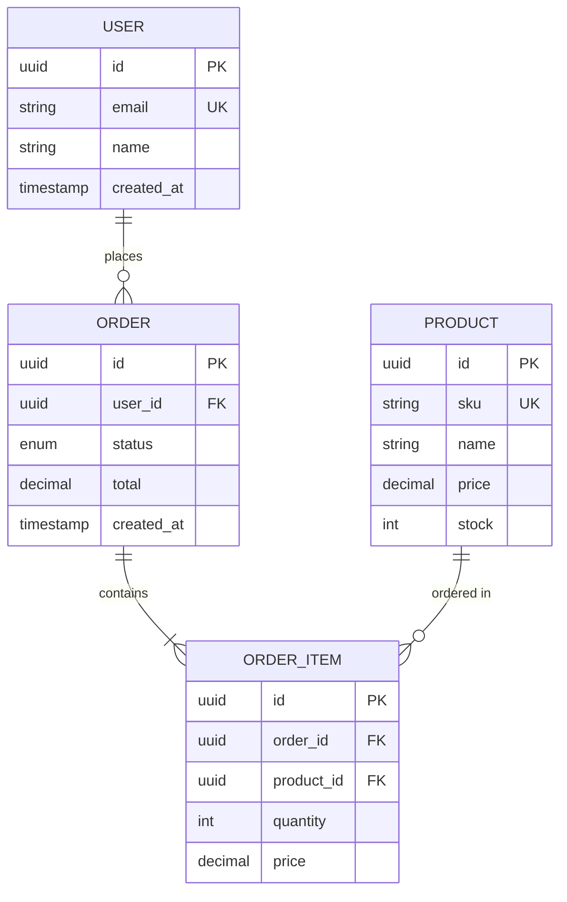

# Task 5.4: `/model` Command Design

**Command Category:** Design & Architecture
**Priority:** MEDIUM-HIGH
**Status:** Design Complete
**Date:** 2025-12-20

---

## Executive Summary

The `/model` command is a specialized Design & Architecture tool for data modeling and schema design. It helps developers design entity-relationship models, database schemas, domain models, and data structure definitions. This command bridges the gap between requirements and implementation by creating structured, validated data models that support multiple database systems and ORM frameworks.

**Key Features:**
- Entity-relationship diagram generation (ERD)
- Multi-database schema generation (PostgreSQL, MySQL, SQLite, MongoDB)
- ORM schema support (Prisma, Drizzle, TypeORM)
- Normalization analysis and recommendations
- Migration file generation
- Domain-driven design (DDD) support

---

## Command Specification

### YAML Frontmatter

```yaml
---
name: model
description: Design entity-relationship models, database schemas, and domain models. Use when creating data structures, database designs, or planning persistence layers.
category: design-architecture
model: sonnet  # Precision required for schema design
allowed-tools: Read, Grep, Glob, Write, Bash
permission_mode: default
---
```

### Command Variants

| Command | Purpose | Output Artifacts |
|---------|---------|------------------|
| `/model` | General data modeling (auto-detect context) | data-model.md, schema.sql, entities.json |
| `/model:erd` | Entity-relationship diagram design | erd-diagram.md, entities.json |
| `/model:schema` | Database schema generation | schema.sql, migrations/*.sql |
| `/model:domain` | Domain model design (DDD) | domain-model.md, aggregates.json |
| `/model:migration` | Migration file generation | migrations/*.sql, rollback.sql |
| `/model:normalize` | Schema normalization analysis | normalization-report.md, normalized-schema.sql |
| `/model:orm` | ORM schema generation | schema.prisma, drizzle.config.ts, etc. |

---

## Output Location

All artifacts go to `docs/models/` with organized subdirectories:

```
docs/models/
├── data-model.md              # Main data model documentation
├── entities.json              # Structured entity definitions
├── erd-diagram.md             # Mermaid ERD diagram
├── domain-model.md            # DDD documentation
├── aggregates.json            # Aggregate definitions
├── normalization-report.md    # Normalization analysis
└── schemas/
    ├── postgresql/
    │   ├── schema.sql
    │   └── migrations/
    ├── prisma/
    │   └── schema.prisma
    └── drizzle/
        └── schema.ts
```

---

## ERD Diagram Examples

### Mermaid ERD Syntax



---

## Database System Support

### PostgreSQL

**Features:**
- Advanced data types (JSONB, arrays, hstore)
- Full-text search
- Table partitioning
- Advanced indexing (GiN, GiST)
- Row-level security
- Generated columns

**Example:**
```sql
CREATE TABLE users (
    id UUID PRIMARY KEY DEFAULT gen_random_uuid(),
    email VARCHAR(255) NOT NULL UNIQUE,
    name VARCHAR(255) NOT NULL,
    tags TEXT[] DEFAULT '{}',
    metadata JSONB DEFAULT '{}',
    created_at TIMESTAMP NOT NULL DEFAULT NOW(),
    updated_at TIMESTAMP NOT NULL DEFAULT NOW()
);

CREATE INDEX idx_users_email ON users(email);
CREATE INDEX idx_users_metadata ON users USING gin(metadata);
```

### MySQL

**Features:**
- Auto-increment IDs
- Spatial data types
- Full-text search (MyISAM, InnoDB)
- JSON support

**Example:**
```sql
CREATE TABLE users (
    id INT AUTO_INCREMENT PRIMARY KEY,
    email VARCHAR(255) NOT NULL UNIQUE,
    name VARCHAR(255) NOT NULL,
    metadata JSON,
    created_at TIMESTAMP DEFAULT CURRENT_TIMESTAMP,
    FULLTEXT KEY idx_users_name (name)
) ENGINE=InnoDB;
```

### MongoDB

**Schema Validation:**
```javascript
db.createCollection("users", {
  validator: {
    $jsonSchema: {
      bsonType: "object",
      required: ["email", "name"],
      properties: {
        email: { bsonType: "string" },
        name: { bsonType: "string" },
        tags: { bsonType: "array", items: { bsonType: "string" } },
        metadata: { bsonType: "object" },
        createdAt: { bsonType: "date" }
      }
    }
  }
});

db.users.createIndex({ email: 1 }, { unique: true });
db.users.createIndex({ name: "text" });
```

---

## ORM Framework Support

### Prisma

```prisma
// schema.prisma
datasource db {
  provider = "postgresql"
  url      = env("DATABASE_URL")
}

generator client {
  provider = "prisma-client-js"
}

model User {
  id        String   @id @default(uuid())
  email     String   @unique
  name      String
  orders    Order[]
  createdAt DateTime @default(now()) @map("created_at")
  updatedAt DateTime @updatedAt @map("updated_at")

  @@map("users")
}

model Order {
  id        String      @id @default(uuid())
  userId    String      @map("user_id")
  user      User        @relation(fields: [userId], references: [id], onDelete: Cascade)
  status    OrderStatus @default(PENDING)
  total     Decimal     @db.Decimal(10, 2)
  items     OrderItem[]
  createdAt DateTime    @default(now()) @map("created_at")
  updatedAt DateTime    @updatedAt @map("updated_at")

  @@map("orders")
  @@index([userId])
  @@index([status])
}

enum OrderStatus {
  PENDING
  PROCESSING
  SHIPPED
  DELIVERED
  CANCELLED
}
```

### Drizzle

```typescript
// drizzle/schema.ts
import { pgTable, uuid, varchar, timestamp, decimal } from 'drizzle-orm/pg-core';

export const users = pgTable('users', {
  id: uuid('id').primaryKey().defaultRandom(),
  email: varchar('email', { length: 255 }).notNull().unique(),
  name: varchar('name', { length: 255 }).notNull(),
  createdAt: timestamp('created_at').notNull().defaultNow(),
  updatedAt: timestamp('updated_at').notNull().defaultNow(),
});

export const orders = pgTable('orders', {
  id: uuid('id').primaryKey().defaultRandom(),
  userId: uuid('user_id').notNull().references(() => users.id, { onDelete: 'cascade' }),
  status: varchar('status', { length: 50 }).notNull().default('pending'),
  total: decimal('total', { precision: 10, scale: 2 }).notNull(),
  createdAt: timestamp('created_at').notNull().defaultNow(),
});
```

---

## Artifact Schemas

### entities.json Schema

```json
{
  "metadata": {
    "artifact_type": "entity-definitions",
    "version": "1.0.0",
    "database_type": "postgresql",
    "orm_framework": "prisma"
  },
  "entities": [
    {
      "name": "User",
      "table_name": "users",
      "type": "core",
      "description": "System users",
      "attributes": [
        {
          "name": "id",
          "type": "UUID",
          "primary_key": true,
          "nullable": false,
          "default": "gen_random_uuid()"
        },
        {
          "name": "email",
          "type": "VARCHAR(255)",
          "nullable": false,
          "unique": true
        },
        {
          "name": "name",
          "type": "VARCHAR(255)",
          "nullable": false
        },
        {
          "name": "created_at",
          "type": "TIMESTAMP",
          "nullable": false,
          "default": "NOW()"
        }
      ],
      "indexes": [
        {
          "name": "idx_users_email",
          "columns": ["email"],
          "unique": true
        }
      ]
    }
  ],
  "relationships": [
    {
      "from": "Order",
      "to": "User",
      "type": "many-to-one",
      "through": null,
      "cardinality": "N:1",
      "description": "Each order belongs to one user"
    }
  ]
}
```

### data-model.md Template

```markdown
---
artifact_type: data-model
command: /model
version: 1.0.0
created_at: [ISO-8601]
database_type: postgresql
orm_framework: prisma
normalization_level: 3NF
---

# Data Model: [Project/Feature Name]

## Overview

[Brief description of the data model and its purpose]

## Entity Catalog

### 1. [Entity Name]

**Purpose:** [What this entity represents]
**Type:** Core | Lookup | Junction | Audit

**Attributes:**
| Column | Type | Constraints | Description |
|--------|------|-------------|-------------|
| id | UUID | PK | Primary identifier |
| name | VARCHAR(255) | NOT NULL | Entity name |
| created_at | TIMESTAMP | NOT NULL | Creation timestamp |

**Relationships:**
- 1:N with [OtherEntity] (as [relationship name])
- M:N with [AnotherEntity] via [JunctionEntity]

**Indexes:**
- PRIMARY KEY (id)
- INDEX (name)

**Business Rules:**
- [Rule 1]
- [Rule 2]

## Relationships Summary

[Mermaid ERD diagram]

## Normalization Analysis

**Current Form:** 3NF

**Functional Dependencies:**
- [entity.attribute] -> [dependent attributes]

**Denormalization Decisions:**
- [Computed field X] - Reason: Performance for common query

## Performance Considerations

**Indexes:**
- [Justification for each index]

**Query Patterns:**
- [Common access patterns that influenced design]

## Migration Strategy

**Phase 1:** Initial schema
**Phase 2:** Add relationships
**Phase 3:** Add constraints and indexes
```

---

## Workflow Integration

### Input Sources

| Artifact | Source Command | Usage |
|----------|----------------|-------|
| `requirements.json` | `/clarify:requirements` | Extract entities from functional requirements |
| `design-spec.md` | `/design` | Use component design for data needs |
| `api-spec.yaml` | `/spec` | Derive entities from API endpoints |
| Existing database | Database inspection | Reverse engineer current schema |

### Output Consumers

| Artifact | Consumer Command | Usage |
|----------|------------------|-------|
| `schema.sql` | `/migrate` | Generate migration files |
| `entities.json` | `/implement` | Code generation for models |
| `data-model.md` | `/document` | Technical documentation |
| `schema.prisma` | Prisma CLI | Database migration and client generation |

---

## Example Usage

### Example 1: New Feature with ERD

```
User: /model:erd e-commerce order system

Claude: I'll design an entity-relationship diagram for your e-commerce order system.

First, let me understand your requirements:
1. What entities do you need? (I'm thinking: User, Product, Order, OrderItem)
2. Do you need inventory management?
3. Should orders support multiple shipping addresses?
4. Any payment tracking needed?

[After Q&A...]

Creating ERD for: User, Product, Category, Order, OrderItem, Payment

Artifacts:
-> docs/models/erd-diagram.md (Mermaid ERD with 6 entities)
-> docs/models/entities.json (Structured entity definitions)

Next steps:
- Run /model:schema to generate PostgreSQL schema
- Run /model:orm to generate Prisma schema
```

### Example 2: Database Schema Generation

```
User: /model:schema users and orders for PostgreSQL

Claude: Generating PostgreSQL schema for users and orders...

[Analyzes existing project context]
- Detected: PostgreSQL database
- Found: Existing migrations/
- Convention: snake_case naming, UUID primary keys

Created:
-> schema/001_create_users.sql
-> schema/002_create_orders.sql
-> schema/003_add_indexes.sql

Schema includes:
- UUID primary keys with gen_random_uuid()
- Foreign key constraints with CASCADE delete
- Timestamps (created_at, updated_at)
- Optimized indexes for common queries
- Check constraints for data validation

Next steps:
- Review schema files
- Run /migrate to apply to database
```

### Example 3: ORM Schema from Existing Database

```
User: /model:orm generate Prisma schema from existing database

Claude: I'll introspect your database and generate a Prisma schema...

[Scans database configuration]
- Database: PostgreSQL
- Connection: Found in .env (DATABASE_URL)
- Tables: users, products, orders, order_items

Generated:
-> prisma/schema.prisma

Features:
- All 4 tables mapped
- Relationships configured
- Indexes preserved
- Naming conventions (camelCase models, snake_case fields)
- Proper @map directives

Next steps:
- Run: npx prisma generate
- Run: npx prisma db push (if needed)
```

---

## Best Practices

### Naming Conventions

**Tables/Collections:**
- Plural nouns (users, orders)
- snake_case (SQL) or camelCase (NoSQL)
- Avoid reserved words

**Columns/Fields:**
- snake_case (SQL) or camelCase (NoSQL)
- Descriptive names (user_id not uid)
- Consistent timestamp naming (created_at, updated_at)

**Indexes:**
- `idx_[table]_[column(s)]`
- Example: `idx_users_email`

**Foreign Keys:**
- `fk_[table]_[column]_[references_table]`
- Example: `fk_orders_user_id_users`

### Primary Key Strategies

**UUID (Recommended for distributed systems):**
```sql
id UUID PRIMARY KEY DEFAULT gen_random_uuid()
```

**Auto-increment (Traditional):**
```sql
id INTEGER AUTO_INCREMENT PRIMARY KEY
```

**CUID (Collision-resistant):**
```sql
id VARCHAR(25) PRIMARY KEY DEFAULT cuid()
```

### Normalization Guidelines

**1NF (First Normal Form):**
- Atomic values (no arrays in cells)
- Each row unique
- No repeating groups

**2NF (Second Normal Form):**
- Must be in 1NF
- No partial dependencies on composite keys

**3NF (Third Normal Form):**
- Must be in 2NF
- No transitive dependencies

**When to denormalize:**
- Read-heavy workloads
- Computed values (expensive to calculate)
- Reporting/analytics tables
- Caching frequently accessed data

---

## Integration with Other Commands

| Command | Relationship | Flow |
|---------|--------------|------|
| `/clarify` | Upstream | Clarify requirements -> Model entities |
| `/spec` | Parallel | API spec <-> Data model alignment |
| `/architect` | Upstream | Architecture -> Data modeling strategy |
| `/design` | Parallel | Component design -> Data needs |
| `/migrate` | Downstream | Model -> Migration generation |
| `/implement` | Downstream | Model -> Code generation (entities, repos) |
| `/test` | Downstream | Model -> Integration tests |
| `/document` | Downstream | Model -> Technical documentation |

---

## Differentiation from Related Commands

### `/model` vs `/design`

| Aspect | `/model` | `/design` |
|--------|----------|-----------|
| Focus | Data structures & persistence | Component interfaces & behavior |
| Output | ERDs, schemas, migrations | Component diagrams, API designs |
| Concerns | Entities, relationships, normalization | Components, interactions, contracts |
| Example | User entity with attributes | UserService with methods |

### `/model` vs `/spec`

| Aspect | `/model` | `/spec` |
|--------|----------|---------|
| Focus | Data layer | API layer |
| Output | Database schemas | OpenAPI, GraphQL schemas |
| Concerns | Persistence, relationships | Endpoints, requests/responses |
| Example | User table schema | POST /users endpoint spec |

### `/model` vs `/architect`

| Aspect | `/model` | `/architect` |
|--------|----------|--------------|
| Focus | Data modeling | System architecture |
| Output | Entity models, schemas | Architecture diagrams, ADRs |
| Level | Detailed (table/field level) | High-level (system/component level) |
| Example | Order aggregate design | Microservices architecture |

---

## Success Criteria

- [ ] Entities are properly identified and classified
- [ ] Relationships are correctly modeled with proper cardinality
- [ ] Schema is normalized to at least 3NF (with documented denormalization)
- [ ] Indexes are optimized for common query patterns
- [ ] Constraints ensure data integrity
- [ ] Migration path is clear and safe
- [ ] ORM schema matches database schema
- [ ] Documentation is comprehensive and up-to-date
- [ ] Schema is validated and tested

---

## References

- **PostgreSQL Documentation:** https://www.postgresql.org/docs/
- **Prisma Schema Reference:** https://www.prisma.io/docs/reference/api-reference/prisma-schema-reference
- **Drizzle ORM:** https://orm.drizzle.team/docs/overview
- **Database Normalization:** https://en.wikipedia.org/wiki/Database_normalization
