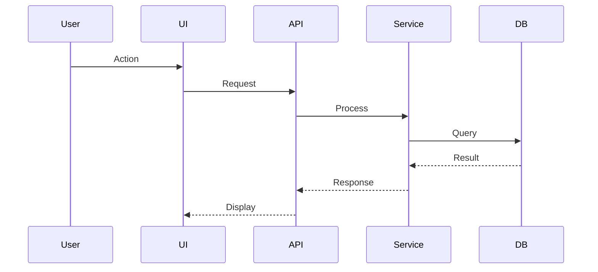

# Phase 7: Artifact Schemas for Implementation & Documentation Commands

**Task:** 7.6 Define artifact schemas for each command
**Date:** 2025-12-20

---

## Overview

This document consolidates all artifact schemas for Phase 7 Implementation & Documentation commands:
- `/implement` - Code generation from specifications
- `/refactor` - Code restructuring and improvement
- `/fix` - Bug fixing and remediation
- `/document` - Documentation generation
- `/explain` - Code and concept explanation

---

## 1. Implementation Artifacts (`/implement`)

### 1.1 implementation-notes.md

**Purpose:** Document implementation decisions, files created, and verification status

```markdown
---
artifact_type: implementation-notes
command: implement:[subcommand]
feature: [feature-name]
version: 1.0.0
created_at: [ISO-8601]
status: complete | partial | needs-review
spec_source: [path-to-spec]
---

# Implementation Notes: [Feature/Component Name]

## Overview
**Implemented:** [Date]
**Specification Source:** [Path to design-spec.md or openapi.yaml]
**Status:** ✅ Complete | 🔄 Partial | ⚠️ Needs Review

## Files Generated

### Source Code
| File | Lines | Description |
|------|-------|-------------|
| `src/[path]/[file].ts` | 150 | Main implementation |
| `src/[path]/[file].types.ts` | 45 | Type definitions |

### Tests
| File | Test Cases | Coverage |
|------|------------|----------|
| `tests/unit/[file].test.ts` | 15 | 95% |
| `tests/integration/[file].test.ts` | 8 | - |

## Implementation Decisions

### Decision 1: [Topic]
**Question:** [What needed deciding]
**Decision:** [What was chosen]
**Rationale:** [Why]

## Design Spec Compliance

| Requirement | Status | Notes |
|-------------|--------|-------|
| FR-001 | ✅ Complete | JWT-based auth |
| NFR-001 | 🔄 Partial | Needs load testing |

## Verification Checklist
- [x] Code compiles without errors
- [x] All tests pass
- [x] Linter passes
- [x] Type definitions complete
- [ ] Integration tests pass (needs CI)

## Next Steps
- [ ] Run full test suite
- [ ] Code review
- [ ] Deploy to staging
```

### 1.2 generated-code-manifest.json

**Purpose:** Machine-readable manifest of all generated files

```json
{
  "metadata": {
    "command": "implement:api",
    "spec_source": "docs/specs/api/v1/openapi.yaml",
    "timestamp": "2025-12-20T10:00:00Z",
    "version": "1.0.0"
  },
  "files": [
    {
      "path": "src/api/routes/users.routes.ts",
      "type": "source",
      "lines": 78,
      "checksum": "sha256:abc123..."
    },
    {
      "path": "tests/integration/api/users.test.ts",
      "type": "test",
      "test_count": 32,
      "checksum": "sha256:def456..."
    }
  ],
  "dependencies_added": [
    { "package": "zod", "version": "^3.22.4", "type": "prod" }
  ],
  "verification": {
    "typescript_check": "pass",
    "lint_check": "pass",
    "tests_pass": true,
    "coverage": 95.2
  }
}
```

---

## 2. Refactoring Artifacts (`/refactor`)

### 2.1 refactoring-plan.md

**Purpose:** Document planned refactoring with impact analysis

```markdown
---
artifact_type: refactoring-plan
command: refactor:[subcommand]
target: [file/module/function]
timestamp: [ISO-8601]
status: pending | approved | executed
---

# Refactoring Plan: [Name]

## Overview
**Type:** [Extract Method | Simplify | Rename | Pattern]
**Target:** `[file/module path]`
**Risk Level:** [Low | Medium | High]
**Estimated Effort:** [Small | Medium | Large]

## Current State Analysis

### Code Metrics (Before)
| Metric | Value | Threshold |
|--------|-------|-----------|
| Cyclomatic Complexity | 15 | 10 |
| Lines of Code | 180 | 100 |
| Nesting Depth | 5 | 3 |

### Problems Identified
1. [Problem 1]
2. [Problem 2]

## Refactoring Strategy

### Steps
| # | Action | Files | Risk |
|---|--------|-------|------|
| 1 | Extract validateEmail() | user-service.ts | Low |
| 2 | Extract hashPassword() | user-service.ts | Low |

### Expected Outcome
| Metric | Before | After | Improvement |
|--------|--------|-------|-------------|
| Complexity | 15 | 8 | -47% |
| LOC | 180 | 160 | -11% |

## Impact Analysis

### Files Affected
| File | Change Type | Tests Affected |
|------|-------------|----------------|
| user-service.ts | Modify | 12 |
| user-controller.ts | Update imports | 3 |

### Breaking Changes
- [ ] None
- [ ] Internal API only
- [ ] Public API changes

## Rollback Plan
1. `git revert HEAD~N` to restore previous state
2. Run test suite to verify restoration
```

### 2.2 impact-analysis.json

**Purpose:** Machine-readable impact assessment

```json
{
  "metadata": {
    "refactoring_type": "extract-method",
    "target": "src/services/user-service.ts",
    "timestamp": "2025-12-20T10:00:00Z"
  },
  "scope": {
    "files_affected": 8,
    "lines_changed": 234,
    "tests_affected": 12,
    "api_surface_changed": false
  },
  "risk_assessment": {
    "overall_risk": "medium",
    "factors": [
      {
        "factor": "code_complexity",
        "risk": "high",
        "reason": "High cyclomatic complexity"
      },
      {
        "factor": "test_coverage",
        "risk": "low",
        "reason": "85% test coverage"
      }
    ]
  },
  "metrics": {
    "before": {
      "cyclomatic_complexity": 15,
      "lines_of_code": 180
    },
    "after": {
      "cyclomatic_complexity": 8,
      "lines_of_code": 160
    },
    "improvement": {
      "complexity_reduction": "47%"
    }
  },
  "recommendations": {
    "proceed": true,
    "approach": "incremental",
    "precautions": [
      "Run full test suite before and after"
    ]
  }
}
```

### 2.3 refactoring-log.md

**Purpose:** Document executed refactoring changes

```markdown
---
artifact_type: refactoring-log
session_id: [unique-id]
command: refactor:[subcommand]
timestamp: [ISO-8601]
---

# Refactoring Log

## Session Information
- **Started:** [timestamp]
- **Completed:** [timestamp]
- **Duration:** [duration]
- **Target:** `[path]`

## Changes Applied

### 1. [Change Name]
**Time:** [timestamp]
**Action:** Extract method

**Before:**
```typescript
// Original code
```

**After:**
```typescript
// Refactored code
```

## Test Results

| Phase | Tests | Passed | Time |
|-------|-------|--------|------|
| Before | 45 | 45 | 2.3s |
| After | 47 | 47 | 2.1s |

## Metrics Improvement

| Metric | Before | After | Change |
|--------|--------|-------|--------|
| Complexity | 15 | 8 | -47% ✅ |
| Coverage | 82.5% | 85.1% | +2.6% ✅ |

## Follow-up Actions
- [ ] Update documentation
- [ ] Add JSDoc comments
- [ ] Schedule code review
```

---

## 3. Fix Artifacts (`/fix`)

### 3.1 fix-report.md

**Purpose:** Document bug fix with root cause and solution

```markdown
---
artifact_type: fix-report
fix_type: [bug | type-error | security | performance | test]
severity: [critical | high | medium | low]
timestamp: [ISO-8601]
issue_id: [original-issue-reference]
---

# Fix Report: [Issue Title]

## Issue Summary
**Type:** [Bug/Security/Performance]
**Severity:** [Critical/High/Medium/Low]
**Affected Components:** [List]
**Original Report:** [Link]

## Root Cause
[Brief explanation of what caused the issue]

**Evidence:**
- Stack trace: [snippet]
- Logs: [relevant entries]

## Solution Applied

### Changes Made
| File | Change | Lines |
|------|--------|-------|
| src/auth/session.ts | Added null check | 45-50 |

### Code Changes
```typescript
// Before:
const userId = user.id; // Crashes if user is null

// After:
if (!user) {
  throw new AuthenticationError('User not found');
}
const userId = user.id;
```

### Why This Works
[Explanation of how the fix addresses root cause]

## Risk Assessment
**Risk Level:** [Low | Medium | High]

**Rollback Plan:**
```bash
git revert [commit-hash]
```

## Testing

### Regression Test Added
```typescript
it('should handle null user gracefully', () => {
  expect(() => service.process(null)).toThrow(AuthenticationError);
});
```

### Test Results
- All tests passing: ✅ (124/124)
- Regression test passing: ✅
- No new failures: ✅

## Prevention Insights
- Add linting rule to catch null access patterns
- Update coding guidelines for null handling
```

### 3.2 regression-test-template.ts

**Purpose:** Template for regression tests

```typescript
/**
 * Regression test for: [Issue Title]
 * Issue ID: [ID]
 * Fixed: [Date]
 *
 * This test verifies that [issue description] does not recur.
 */

import { describe, it, expect, beforeEach } from 'vitest';
import { ComponentUnderTest } from '@/path/to/component';

describe('Regression: [Issue ID] - [Brief Title]', () => {
  let component: ComponentUnderTest;

  beforeEach(() => {
    component = new ComponentUnderTest();
  });

  it('should [expected behavior that was failing]', () => {
    // Arrange - Setup that triggers the original bug
    const input = /* reproduction case */;

    // Act - Execute the fixed code
    const result = component.method(input);

    // Assert - Verify the fix
    expect(result).toBe(/* expected value */);
  });

  it('should handle edge case: [edge case description]', () => {
    // Additional edge case tests
  });
});
```

### 3.3 fix-notes.md

**Purpose:** Session summary of all fixes applied

```markdown
---
artifact_type: fix-notes
session_date: [ISO-8601]
---

# Fix Notes: [Session Date]

## Fixes Applied

### FIX-001: [Issue Title]
- **Status:** ✅ Applied
- **Files:** `src/auth/login.ts`
- **Commit:** [hash]
- **Report:** `fix-report-001.md`

### FIX-002: [Issue Title]
- **Status:** ⚠️ Partial
- **Blocker:** Needs design decision
- **Report:** `fix-report-002.md`

## Summary
| Status | Count |
|--------|-------|
| Applied | 3 |
| Pending | 1 |
| Blocked | 1 |

## Next Steps
- [ ] Review FIX-002 with team
- [ ] Deploy fixes to staging
```

---

## 4. Documentation Artifacts (`/document`)

### 4.1 README.md Template

```markdown
---
artifact_type: readme
command: document:developer
project: [project-name]
version: [version]
---

# [Project Name]

> [One-line description]

[](link) [](link)

## Overview
[2-3 paragraph description]

## Quick Start
```bash
npm install [package]
```

## Features
- **[Feature 1]**: Description
- **[Feature 2]**: Description

## Documentation
- [Getting Started](docs/getting-started.md)
- [API Reference](docs/api/reference.md)

## Development
```bash
git clone [repo]
npm install
npm test
```

## Contributing
See [CONTRIBUTING.md](CONTRIBUTING.md)

## License
[License] - see [LICENSE](LICENSE)
```

### 4.2 api-reference.md Template

```markdown
---
artifact_type: api-reference
command: document:api
api_version: [version]
base_url: [url]
---

# API Reference

## Overview
**Base URL:** `https://api.example.com/v1`
**Authentication:** Bearer token

## Endpoints

### Users

#### List Users
```http
GET /users
Authorization: Bearer {token}
```

**Parameters:**
| Name | Type | Required | Description |
|------|------|----------|-------------|
| page | int | No | Page number |

**Response:** `200 OK`
```json
{
  "data": [{ "id": "...", "email": "..." }],
  "pagination": { "page": 1, "total": 100 }
}
```

## Error Handling
```json
{
  "error": {
    "code": "ERROR_CODE",
    "message": "Description"
  }
}
```
```

### 4.3 CHANGELOG.md Template (Keep-a-Changelog)

```markdown
---
artifact_type: changelog
command: document:changelog
format: keep-a-changelog
---

# Changelog

All notable changes per [Keep a Changelog](https://keepachangelog.com/).

## [Unreleased]

### Added
- New features in development

## [1.2.0] - 2025-12-20

### Added
- Payment refund functionality (#234)

### Fixed
- Race condition in payment processing (#243)

### Security
- Added webhook signature verification (#245)

[Unreleased]: https://github.com/user/repo/compare/v1.2.0...HEAD
[1.2.0]: https://github.com/user/repo/releases/tag/v1.2.0
```

---

## 5. Explanation Artifacts (`/explain`)

### 5.1 code-explanation.md Template

```markdown
---
artifact_type: code-explanation
command: explain:code
target: [file-path]
created: [ISO-8601]
tags: [component, auth, etc.]
---

# Code Explanation: [Component Name]

**File:** `path/to/file.ext`
**Purpose:** [One-line description]

## Quick Summary
[2-3 sentences explaining what and why]

## Purpose & Motivation
### Problem Statement
[What problem does this solve?]

### Design Goals
- [Goal 1]
- [Goal 2]

## Core Concepts
### Responsibilities
- **Primary:** [Main responsibility]
- **Secondary:** [Supporting]

### Key Interfaces
```typescript
export interface Service {
  method(param: Type): ReturnType;
}
```

## Implementation Details
### Architecture Pattern
[Pattern: Repository, Service, Factory, etc.]

### Key Algorithms
[Description with complexity: O(n)]

## Usage Examples
```typescript
const service = new Service(deps);
const result = await service.method(input);
```

## Integration & Dependencies
| Dependency | Purpose | Critical |
|------------|---------|----------|
| Repository | Data access | Yes |

## Gotchas & Best Practices
### Gotchas
1. **Race condition in updateState()** - Use locking

### Best Practices
1. Always validate inputs
2. Use dependency injection

## Related Documentation
- Architecture: `docs/architecture/`
- ADR: `docs/adr/0003.md`
```

### 5.2 flow-explanation.md Template

```markdown
---
artifact_type: flow-explanation
command: explain:flow
feature: [feature-name]
created: [ISO-8601]
---

# Flow Explanation: [Flow Name]

**Flow Type:** [Data/Control/Event Flow]
**Complexity:** [Simple/Moderate/Complex]

## Quick Summary
[What this flow accomplishes end-to-end]

## High-Level Diagram


## Step-by-Step Walkthrough

### Step 1: [Name]
**Location:** `src/entry.ts`
**What Happens:** [Description]
**Data:** Input → Output transformation

### Step 2: [Name]
[Continue for all steps...]

## Error Handling
| Error Type | Recovery |
|------------|----------|
| Validation | Return 400 |
| Database | Retry with backoff |

## Performance
| Step | Latency | Risk |
|------|---------|------|
| DB Query | ~50ms | Medium |
| External API | ~200ms | High |
```

### 5.3 decision-explanation.md Template

```markdown
---
artifact_type: decision-explanation
command: explain:decision
decision: [topic]
created: [ISO-8601]
status: active | superseded
---

# Decision Explanation: [Topic]

**Decision Date:** [When]
**Status:** [Active | Superseded]

## Quick Summary
[What was decided and why]

## Context & Problem
### Situation
[What was the context?]

### Problem
[What specific problem needed solving?]

## Decision
**What Was Decided:** [Clear statement]

**Assumptions:**
- [Assumption 1]
- [Assumption 2]

## Options Considered

### Option 1: [Name]
**Pros:** ✅ [Advantage]
**Cons:** ❌ [Disadvantage]
**Verdict:** Rejected

### Option 2: [Name] ← Selected
**Pros:** ✅ [Advantage]
**Cons:** ⚠️ [Trade-off]
**Verdict:** Selected

## Rationale
[Why this option was chosen]

## Consequences
### Positive
- ✅ [Benefit realized]

### Negative
- ⚠️ [Trade-off accepted]
- **Mitigation:** [How addressed]

## References
- ADR: `docs/adr/0001.md`
- Discussion: GitHub Issue #123
```

---

## Schema Summary

| Command | Artifact | Format | Purpose |
|---------|----------|--------|---------|
| `/implement` | implementation-notes.md | MD | Implementation documentation |
| `/implement` | generated-code-manifest.json | JSON | Machine-readable file list |
| `/refactor` | refactoring-plan.md | MD | Pre-refactoring plan |
| `/refactor` | impact-analysis.json | JSON | Risk assessment |
| `/refactor` | refactoring-log.md | MD | Execution log |
| `/fix` | fix-report.md | MD | Fix documentation |
| `/fix` | regression-test.ts | TS | Regression test template |
| `/fix` | fix-notes.md | MD | Session summary |
| `/document` | README.md | MD | Project overview |
| `/document` | api-reference.md | MD | API documentation |
| `/document` | CHANGELOG.md | MD | Version history |
| `/explain` | code-explanation.md | MD | Code explanation |
| `/explain` | flow-explanation.md | MD | Flow explanation |
| `/explain` | decision-explanation.md | MD | Decision explanation |

---

**Phase 7 Task 7.6 Status: COMPLETE**
