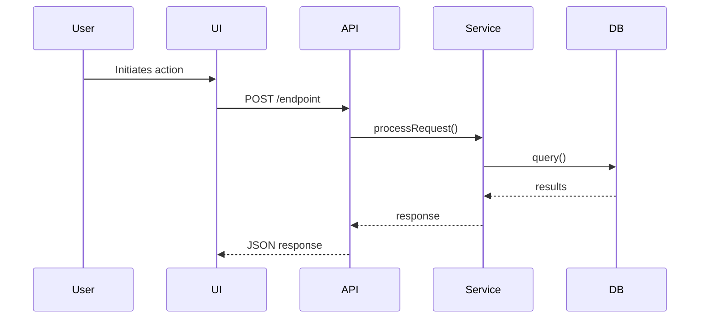

# /explain Command Design Specification

**Task:** 7.5 Design `/explain` command (code/concept explanation)
**Category:** Documentation & Knowledge Transfer
**Priority:** HIGH
**Date:** 2025-12-20

---

## Executive Summary

The `/explain` command provides intelligent code and concept explanation capabilities for onboarding, documentation, code review, and knowledge transfer. Unlike `plan:explain` which explains plan tasks, `/explain` focuses on explaining existing code, architecture patterns, design decisions, and technical concepts within a codebase.

**Key Differentiator:** `/explain` is a **knowledge extraction and transfer** tool that helps developers understand "why" and "how" code works, not "what to do" (which is `plan:explain`'s domain).

**Primary Use Cases:**
- Onboarding new team members to complex codebases
- Documenting legacy code or undocumented systems
- Code review assistance (explaining changes in context)
- Architecture decision archaeology (understanding past choices)
- Pattern documentation (identifying and explaining recurring patterns)

---

## Sub-Command Specifications

| Sub-command | Purpose | Output | Priority |
|-------------|---------|--------|----------|
| `explain:code` | Explain code files, functions, classes | `code-explanation.md` | P0 |
| `explain:architecture` | Explain system architecture | `architecture-explanation.md` | P0 |
| `explain:pattern` | Identify and explain code patterns | `pattern-explanation.md` | P1 |
| `explain:decision` | Explain architectural decisions | `decision-explanation.md` | P1 |
| `explain:flow` | Explain execution and data flow | `flow-explanation.md` | P1 |
| `explain:api` | Explain API design and contracts | `api-explanation.md` | P2 |
| `explain:diff` | Explain changes in a diff/PR | `diff-explanation.md` | P2 |

---

## YAML Frontmatter Specification

### Primary Command: `.claude/commands/explain.md`

```yaml
---
name: explain
description: Intelligent code and concept explanation for onboarding, documentation, and knowledge transfer. Use when understanding existing code, not planning tasks.
model: sonnet
allowed-tools: Read, Grep, Glob, Write, Bash, AskUserQuestion
argument-hint: [file-path | concept | pattern]
---
```

---

## Explanation Principles

### 1. Start with the "Why"
- What problem does this solve?
- Why was it built this way?
- What alternatives were considered?

### 2. Explain the "What"
- What does this component do?
- What are its responsibilities?
- What are its boundaries?

### 3. Detail the "How"
- How does it work internally?
- How does it integrate with other components?
- How is it used/invoked?

### 4. Provide Context
- Historical context (when applicable)
- Dependencies and relationships
- Related patterns and conventions
- Examples and usage

### 5. Identify Gotchas
- Common pitfalls
- Edge cases
- Performance considerations
- Security implications

---

## Output Location

```
docs/explanations/
├── code/
│   └── auth-service-2025-12-20.md
├── architecture/
│   └── data-layer-2025-12-20.md
├── patterns/
│   └── repository-pattern-2025-12-20.md
├── decisions/
│   └── why-microservices-2025-12-20.md
├── flows/
│   └── user-checkout-flow-2025-12-20.md
└── index.md  # Auto-generated index
```

---

## Artifact Schemas

### code-explanation.md Template

```markdown
---
type: code-explanation
command: explain:code
target: [file-path or symbol]
created: [ISO-8601]
---

# Code Explanation: [Component Name]

**File:** `path/to/file.ext`
**Purpose:** [One-line description]

## Quick Summary
[2-3 sentences explaining what this code does and why]

## Purpose & Motivation
### Problem Statement
[What problem does this solve?]

### Design Goals
- [Goal 1]
- [Goal 2]

## Core Concepts
### Responsibilities
- **Primary:** [Main responsibility]
- **Secondary:** [Supporting responsibilities]

### Key Interfaces
```typescript
export interface ServiceInterface {
  method1(param: Type): ReturnType;
}
```

## Implementation Details
### Architecture Pattern
[Pattern used: Repository, Service, Factory, etc.]

### Key Algorithms
[Description with complexity analysis]

## Usage Examples
```typescript
const service = new Service(dependencies);
const result = await service.doSomething(input);
```

## Integration & Dependencies
### Upstream Dependencies
| Dependency | Purpose | Critical? |
|------------|---------|-----------|
| `Repository` | Data access | Yes |

### Downstream Consumers
| Consumer | Usage |
|----------|-------|
| `APIController` | Handles HTTP requests |

## Common Gotchas & Best Practices
### Gotchas
1. **Race condition in `updateState()`** - Use locking

### Best Practices
1. Always validate inputs before processing
2. Use dependency injection for testability

## Related Documentation
- **Architecture:** `docs/architecture/data-layer.md`
- **ADR:** `docs/architecture/adr/0003-service-layer.md`
```

### flow-explanation.md Template

```markdown
---
type: flow-explanation
command: explain:flow
feature: [feature-name]
created: [ISO-8601]
---

# Flow Explanation: [Feature/Flow Name]

**Flow Type:** [Data Flow / Control Flow / Event Flow]
**Entry Points:** [number]

## Quick Summary
[2-3 sentences explaining what this flow accomplishes]

## High-Level Flow Diagram


## Step-by-Step Walkthrough
### Step 1: [Step Name]
**Location:** `src/components/entry-point.ts`
**What Happens:** [Detailed explanation]

### Step 2: [Step Name]
[Continue for all steps...]

## Error Handling
| Error Type | Recovery Strategy |
|------------|-------------------|
| Validation Failure | Return 400 |
| Database Error | Retry with backoff |

## Performance Characteristics
| Step | Typical Latency | Bottleneck Risk |
|------|----------------|-----------------|
| Database Query | ~50ms | Medium |
| External API | ~200ms | High |
```

---

## Workflow Integration

### Upstream Commands (Inputs)

| Artifact | Source Command | Purpose |
|----------|---------------|---------|
| Code files | Development | Explain existing code |
| `architecture.md` | `/architect` | Understand system design |
| `adr/*.md` | `/architect:adr` | Decision context |
| PR diffs | Git/GitHub | Explain changes |

### Downstream Commands (Outputs)

| Artifact | Consumed By | Purpose |
|----------|-------------|---------|
| `code-explanation.md` | Onboarding docs | Knowledge transfer |
| `pattern-explanation.md` | Code review | Pattern enforcement |
| `flow-explanation.md` | `/debug`, `/test` | Understanding behavior |

### Integration with Onboarding

```
New Developer Joins
    ↓
/explain:architecture [system]
    ↓
/explain:pattern [common-patterns]
    ↓
/explain:code [core-components]
    ↓
/explain:flow [critical-flows]
    ↓
Onboarding Complete
```

---

## Example Usage Scenarios

### Example 1: Explain a Code File

```
User: /explain src/auth/authentication-service.ts

Claude: I'll explain the AuthenticationService component.

[Searches for related files, tests, dependencies]

Found:
→ src/auth/authentication-service.ts (main)
→ src/auth/interfaces.ts (types)
→ tests/unit/auth/authentication-service.test.ts
→ docs/architecture/adr/0003-auth-strategy.md

# Code Explanation: Authentication Service

## Quick Summary
The AuthenticationService handles user authentication using JWT tokens,
providing login, logout, and token refresh capabilities.

[Full detailed explanation...]
```

### Example 2: Explain Architecture

```
User: /explain:architecture data layer

Claude: Analyzing the data layer architecture...

Found patterns:
→ Repository Pattern (12 implementations)
→ Unit of Work Pattern
→ Two-tier caching (Redis + in-memory)

# Architecture Explanation: Data Layer

## Quick Summary
The data layer uses Repository pattern with generic base classes,
separating data access from business logic.

[Detailed architecture explanation with diagrams...]
```

### Example 3: Explain a Decision

```
User: /explain:decision why did we choose microservices?

Claude: Searching for architectural decisions...

Found:
→ docs/architecture/adr/0001-monolith-to-microservices.md
→ GitHub Discussion #456

# Decision Explanation: Migration to Microservices

## Context
Migrated from monolith to microservices in Q2 2024 for
independent team scaling and deployment.

## Trade-offs
✅ Deployment frequency: 1x/week → 10x/day
⚠️ Operational complexity increased
```

---

## Differentiation from Related Commands

### `/explain` vs `plan:explain`
| Aspect | `/explain` | `plan:explain` |
|--------|-----------|----------------|
| **Focus** | Code, architecture, concepts | Plan tasks |
| **Input** | Files, patterns, flows | Task IDs from plans |
| **Output** | Knowledge documentation | Implementation guidance |
| **Purpose** | Understanding existing system | Understanding planned work |

### `/explain` vs `/document`
| Aspect | `/explain` | `/document` |
|--------|-----------|--------------|
| **Purpose** | Educational, understanding | Reference, API docs |
| **Style** | Narrative, contextual | Structured, formal |
| **Audience** | Learners, onboarding | Users, integrators |
| **Depth** | Deep dive with "why" | Breadth with "what/how" |

### `/explain` vs `/explore`
| Aspect | `/explain` | `/explore` |
|--------|-----------|-----------|
| **Purpose** | Deep understanding of specifics | Broad discovery |
| **Direction** | Focused (explain this thing) | Open-ended (what's here?) |
| **Output** | Rich narrative explanation | Structured map/catalog |

---

## Quality Gates

Before marking explanation complete, verify:

- ✅ Explanation starts with "why" (motivation/purpose)
- ✅ Code examples are from actual codebase
- ✅ Diagrams included where helpful (Mermaid)
- ✅ Related files and dependencies identified
- ✅ Usage examples provided
- ✅ Gotchas and best practices documented
- ✅ Related documentation linked
- ✅ Appropriate depth for audience
- ✅ Technical accuracy verified

---

## Success Criteria

An explanation is successful when:

- ✅ A new developer can understand the component after reading
- ✅ The "why" is clear, not just the "what" and "how"
- ✅ Examples are concrete and from actual codebase
- ✅ Related concepts and dependencies are linked
- ✅ Edge cases and gotchas are identified
- ✅ Reader knows where to go for more detail

---

**Phase 7 Task 7.5 Status: COMPLETE**
