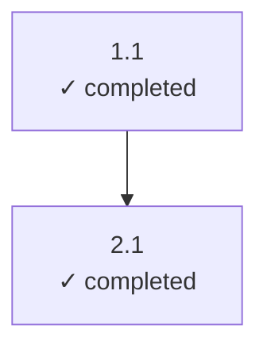

# Test Dependency Patterns - Documentation

**Task 4.3: Generate documentation** (depends: 1.4, 2.4, 3.4)

This documentation provides comprehensive API reference and usage guides for the
Test Dependency Patterns validation system.

---

## Overview

This module provides utilities for validating DAG-aware scheduling with complex
dependency patterns. It includes:

- **Shared Utility Functions** (Task 1.4) - Core dependency parsing and analysis
- **Utility Wrappers** (Task 2.4) - Higher-level abstractions and visualization
- **Combined Strategy** (Task 3.4) - Adaptive scheduling combining multiple strategies

---

## Module: Shared Utilities (`utils/shared-utils.js`)

Core functions for dependency parsing, validation, and graph analysis.

### Functions

#### `parseDependencies(description)`

Parse task dependencies from a task description.

**Parameters:**
- `description` (string) - Task description containing `(depends: X.Y, X.Z)` pattern

**Returns:** `string[]` - Array of dependency task IDs

**Example:**
```javascript
const deps = parseDependencies('Build feature (depends: 1.1, 1.2)');
// Returns: ['1.1', '1.2']
```

---

#### `areDependenciesSatisfied(dependencies, taskStatus)`

Check if all dependencies are satisfied.

**Parameters:**
- `dependencies` (string[]) - Array of dependency task IDs
- `taskStatus` (Object) - Map of task ID to status

**Returns:** `boolean` - True if all dependencies are completed or skipped

**Example:**
```javascript
const satisfied = areDependenciesSatisfied(['1.1', '1.2'], {
  '1.1': 'completed',
  '1.2': 'completed'
});
// Returns: true
```

---

#### `findReadyTasks(tasks)`

Find all ready tasks (pending with satisfied dependencies).

**Parameters:**
- `tasks` (Object[]) - Array of task objects with `id`, `status`, and `dependencies`

**Returns:** `Object[]` - Tasks that are ready to execute

---

#### `calculateCriticalPathLength(tasks)`

Calculate critical path length through task graph using dynamic programming.

**Parameters:**
- `tasks` (Object[]) - Array of task objects with dependencies

**Returns:** `number` - Length of the critical path

---

#### `detectCycles(tasks)`

Detect cycles in dependency graph using DFS with recursion stack.

**Parameters:**
- `tasks` (Object[]) - Array of task objects with dependencies

**Returns:** `string[]|null` - Cycle path if found, null otherwise

---

#### `formatStatus(status)`

Format task status for display with symbol.

**Parameters:**
- `status` (string) - Task status value

**Returns:** `string` - Formatted status (e.g., "✓ completed")

**Status Symbols:**
| Status | Symbol |
|--------|--------|
| completed | ✓ |
| in_progress | ◐ |
| pending | ◯ |
| failed | ✗ |
| skipped | ⊘ |

---

## Module: Utility Wrappers (`utils/utility-wrappers.js`)

Higher-level abstractions built on shared-utils.js.

### Class: BatchOperations

Provides batch processing of multiple tasks.

#### `static parseAllDependencies(tasks)`

Parse dependencies for multiple tasks at once.

**Returns:** `Object` - Map of task ID to dependencies array

---

#### `static checkAllDependencies(tasks)`

Check which tasks have all dependencies satisfied.

**Returns:** `Object` - Map of task ID to satisfaction status (boolean)

---

#### `static getExecutionSequence(tasks)`

Get execution sequence based on dependencies.

**Returns:** `Object[][]` - Array of execution batches, each containing tasks
that can run in parallel.

**Example:**
```javascript
const sequence = BatchOperations.getExecutionSequence(tasks);
// Returns: [[task1, task2], [task3], [task4, task5]]
// Batch 1: task1, task2 run in parallel
// Batch 2: task3 runs after batch 1
// Batch 3: task4, task5 run in parallel
```

---

#### `static updateTasksStatus(tasks, taskIds, newStatus)`

Update multiple task statuses at once.

**Returns:** `Object[]` - Updated tasks array (immutable update)

---

### Class: LoggingWrapper

Enhanced logging for dependency tracking and execution debugging.

#### Constructor Options

| Option | Type | Default | Description |
|--------|------|---------|-------------|
| verbose | boolean | false | Log to console in real-time |
| prefix | string | '[DEP-DEBUG]' | Prefix for log messages |

#### Methods

- `logDependencyCheck(task, satisfied)` - Log dependency analysis
- `logReadyTasks(readyTasks)` - Log identified ready tasks
- `logCriticalPath(pathLength, totalTasks)` - Log critical path analysis
- `logCycleDetection(cycle)` - Log cycle detection results
- `logExecutionTrace(tasks)` - Log full execution trace
- `getLogs()` - Get all logs as formatted string
- `clearLogs()` - Clear log buffer

---

### Class: TaskGraphVisualizer

Generate visual representations of task graphs.

#### `static generateDependencyTree(tasks)`

Generate ASCII tree representation of task dependencies.

**Example output:**
```
Task Dependency Tree:
└─ 3.4 ◯ pending
  ├─ 3.2 ✓ completed
  │ └─ 3.1 ✓ completed
  └─ 3.3 ✓ completed
    └─ 3.1 (circular)
```

---

#### `static generateLayerVisualization(tasks)`

Generate layer visualization showing parallel execution groups.

**Example output:**
```
Parallel Execution Layers:
Layer 0: [4] 1.1, 1.2, 1.3, 1.4
Layer 1: [4] 2.1, 2.2, 2.3, 2.4
Layer 2: [1] 3.1
Layer 3: [2] 3.2, 3.3
Layer 4: [1] 3.4
```

---

#### `static generateMermaidDiagram(tasks)`

Generate Mermaid diagram syntax for task graph visualization.

**Example output:**


---

### Class: ExecutionStatusSummary

Comprehensive status analysis and reporting.

#### `static generateSummary(tasks)`

Generate overall execution summary.

**Returns:**
```javascript
{
  totalTasks: 10,
  statusCounts: { completed: 5, pending: 4, failed: 1 },
  completionPercentage: '50.00%',
  readyTasksCount: 3,
  readyTaskIds: ['3.1', '3.2', '3.3'],
  criticalPathLength: 4,
  hasCycle: false,
  cycleDetails: null
}
```

---

#### `static generateStatusReport(tasks)`

Generate human-readable status report.

**Example output:**
```
EXECUTION STATUS REPORT
=======================

Total Tasks: 10
Completion: 50.00%

Task Status Breakdown:
  ✓ completed: 5 (50.0%)
  ◯ pending: 4 (40.0%)
  ✗ failed: 1 (10.0%)

Ready for Execution: 3
  Tasks: 3.1, 3.2, 3.3

Critical Path Length: 4 layers
Parallelism Factor: 2.50x

Dependency Graph:
  Cycle Detection: Acyclic
```

---

#### `static generateDependencyMatrix(tasks)`

Generate task dependency matrix showing relationships.

---

#### `static analyzeBottlenecks(tasks)`

Identify potential bottlenecks in task graph.

**Returns:** Array of bottleneck objects sorted by criticality score.

---

## Module: Combined Strategy (`strategies/combined-strategy.js`)

Adaptive scheduling strategy combining eager execution and critical path prioritization.

### Strategy A: Eager Execution

Executes tasks as soon as dependencies are met, maximizing throughput.

**Properties:**
- `name`: 'Eager Execution'
- `priority`: 'throughput'

---

### Strategy B: Critical Path First

Prioritizes tasks on the critical path, minimizing latency.

**Properties:**
- `name`: 'Critical Path First'
- `priority`: 'latency'

---

### Combined Strategy: Adaptive Scheduling

Uses Strategy A for throughput when many tasks are ready, Strategy B when on critical path.

**Properties:**
- `name`: 'Adaptive Scheduling'
- `priority`: 'balanced'

#### `selectTasks(readyTasks, maxParallel, context)`

Select tasks for execution using adaptive strategy.

**Logic:**
1. If `readyTasks.length > maxParallel * 2`: Use eager strategy
2. If critical path tasks are ready: Prioritize critical path
3. Default: Eager execution

---

#### `shouldExecute(task, context)`

Decide if a specific task should execute now.

**Logic:**
1. Check dependencies are met
2. If on critical path: always execute
3. Otherwise: execute if slots available

---

## Usage Examples

### Basic Dependency Checking

```javascript
const { parseDependencies, areDependenciesSatisfied } = require('./utils/shared-utils');

const taskDescription = 'Build feature (depends: 1.1, 2.3)';
const deps = parseDependencies(taskDescription);
// deps = ['1.1', '2.3']

const status = { '1.1': 'completed', '2.3': 'completed' };
const ready = areDependenciesSatisfied(deps, status);
// ready = true
```

### Batch Processing

```javascript
const { BatchOperations } = require('./utils/utility-wrappers');

const tasks = [
  { id: '1.1', status: 'completed', dependencies: [] },
  { id: '2.1', status: 'pending', dependencies: ['1.1'] },
  { id: '2.2', status: 'pending', dependencies: ['1.1'] }
];

const sequence = BatchOperations.getExecutionSequence(tasks);
// sequence = [[task '2.1', task '2.2']]  (both can run in parallel)
```

### Visualization

```javascript
const { TaskGraphVisualizer } = require('./utils/utility-wrappers');

const layerViz = TaskGraphVisualizer.generateLayerVisualization(tasks);
console.log(layerViz);
```

### Status Reporting

```javascript
const { ExecutionStatusSummary } = require('./utils/utility-wrappers');

const report = ExecutionStatusSummary.generateStatusReport(tasks);
console.log(report);
```

---

## Dependency Patterns Tested

This module validates the following dependency patterns:

1. **No Dependencies** (Phase 1) - Independent parallel tasks
2. **Simple Dependencies** (Phase 2) - Linear A→B dependencies
3. **Diamond Pattern** (Phase 3) - A→B, A→C, B→D, C→D
4. **Cross-Phase Dependencies** (Phase 4) - Dependencies across phases
5. **Long Chain** (Phase 5) - Sequential A→B→C→D→E→F
6. **Fan-Out Pattern** (Phase 6) - One task with many dependents
7. **Fan-In Pattern** (Phase 7) - Many tasks flowing to one
8. **Mixed Complex** (Phase 8) - Combination of all patterns

---

*Generated: 2025-12-26*
*Task: 4.3 - Generate documentation*
*Dependencies: 1.4 (shared-utils), 2.4 (utility-wrappers), 3.4 (combined-strategy)*
