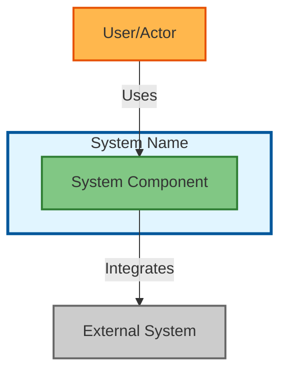
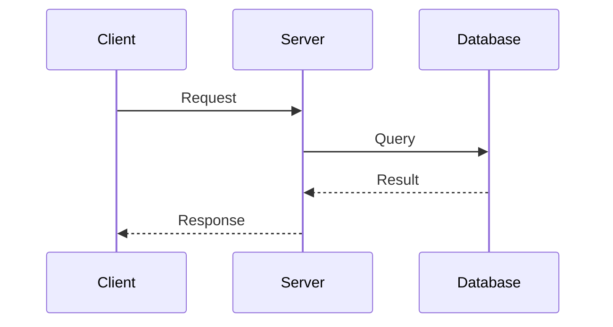
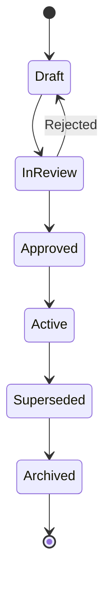
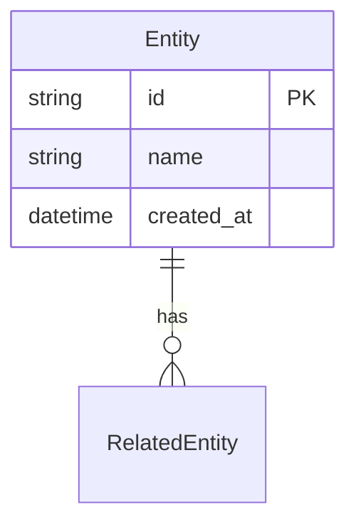

# Implementation Plan Standards

> **Note:** This document is being superseded by [PLAN-STANDARDS.md](PLAN-STANDARDS.md).
> For the unified specification, see the new document.

This document defines the authoritative standards for all implementation plans in `docs/plans/implement-*.md`. These standards ensure consistency, enable automation, and improve maintainability across the command library.

**Version:** 1.0
**Last Updated:** 2025-12-23
**Applies To:** All files in `docs/plans/implement-*.md`

---

## Table of Contents

1. [Naming Conventions](#naming-conventions)
2. [Priority Levels](#priority-levels)
3. [Quality Targets](#quality-targets)
4. [Plan Structure](#plan-structure)
5. [VERIFY Section Format](#verify-section-format)
6. [Artifact Standards](#artifact-standards)
7. [Artifact Discovery Patterns](#artifact-discovery-patterns)
8. [Diagram Generation Standards](#diagram-generation-standards)
9. [Input Validation Standards](#input-validation-standards)
10. [Severity Classifications](#severity-classifications)
11. [Model Selection Guidelines](#model-selection-guidelines)
12. [Quality Gate Standards](#quality-gate-standards)
13. [Performance Targets](#performance-targets)
14. [Command Configuration](#command-configuration)
15. [Decision Log (ADR) Template](#decision-log-adr-template)

---

## Naming Conventions

### Sub-Command Notation

**Standard:** Use colon notation for all sub-commands.

| Correct | Incorrect |
|---------|-----------|
| `/explore:quick` | `/explore quick` |
| `/analyze:security` | `/analyze-security` |
| `/test:unit` | `/test unit` |
| `/plan:implement` | `/plan implement` |

**Pattern:** `/{command}:{subcommand}`

**Examples:**
```
/explore:quick       # Quick codebase exploration
/explore:deep        # Deep exploration with analysis
/analyze:security    # Security-focused analysis
/analyze:performance # Performance analysis
/test:unit           # Run unit tests
/test:e2e            # Run end-to-end tests
/validate:types      # Type checking
/validate:lint       # Linting
```

### Model Identifiers

**Standard:** Use short-form model names only.

| Short Form | Full Model ID (Do Not Use) |
|------------|---------------------------|
| `opus` | `claude-opus-4-5-20251101` |
| `sonnet` | `claude-sonnet-4-20250514` |
| `haiku` | `claude-haiku-3-5-20241022` |

**Usage in plans:**
```markdown
**Model:** sonnet (default)
**Model:** opus (for complex reasoning tasks)
**Model:** haiku (for simple formatting tasks)
```

### Artifact Type Names

**Standard:** Use kebab-case for all artifact types.

| Correct (kebab-case) | Incorrect |
|---------------------|-----------|
| `validation-report` | `validation_report`, `validationReport` |
| `architecture-document` | `architecture_document` |
| `codebase-map` | `codebaseMap`, `codebase_map` |
| `requirements-spec` | `RequirementsSpec` |
| `test-results` | `test_results` |
| `exploration-report` | `ExplorationReport` |

**Artifact type registry:**
```
analysis-report       # Output from /analyze
architecture-document # Output from /architect
audit-report          # Output from /audit
codebase-map          # Output from /explore
component-spec        # Output from /design
exploration-report    # Output from /explore
implementation-plan   # Output from /plan
requirements-spec     # Output from /clarify
review-report         # Output from /review
test-results          # Output from /test
validation-report     # Output from /validate
```

### File and Directory Names

**Standard:** Use kebab-case for files and directories.

| Type | Pattern | Example |
|------|---------|---------|
| Plan files | `implement-{command}-command.md` | `implement-explore-command.md` |
| Output directories | `docs/plan-outputs/{plan-name}/` | `docs/plan-outputs/implement-explore-command/` |
| Artifact files | `{artifact-type}.{format}` | `validation-report.json` |
| Finding files | `{task-id}-{description}.md` | `1.1-analysis-results.md` |

### Command Group Names

**Standard:** Use lowercase, single-word names when possible.

| Correct | Incorrect |
|---------|-----------|
| `explore` | `Explore`, `EXPLORE` |
| `analyze` | `Analyze`, `code-analyze` |
| `validate` | `Validate`, `run-validation` |

---

## Priority Levels

### Definitions

| Priority | Name | Description | Implementation Order |
|----------|------|-------------|---------------------|
| **P0** | Critical Path | Foundation commands that other commands depend on. Must be implemented first. | Wave 1 |
| **P1** | Important | Core functionality commands. Required for primary workflows. | Wave 2-3 |
| **P2** | Enhancement | Nice-to-have features. Can be deferred without blocking other work. | Wave 4+ |

### Assignment Criteria

**P0 (Critical Path):**
- Commands that provide infrastructure used by other commands
- Artifact registry, error recovery, core hooks
- Commands with no upstream dependencies but many downstream consumers

**P1 (Important):**
- Core workflow commands (explore, analyze, test, validate)
- Commands that are frequently used in standard workflows
- Commands that produce artifacts consumed by P0 commands

**P2 (Enhancement):**
- Advanced features and optimizations
- Workflow automation and composition
- Specialized commands for niche use cases

### Priority Dependency Rules

1. A command's priority must be less than or equal to its dependencies
2. P0 commands cannot depend on P1 or P2 commands
3. P1 commands cannot depend on P2 commands
4. Document exceptions with rationale if rules must be broken

**Validation check:**
```
For each command C with dependencies D1, D2, ...:
  priority(C) >= max(priority(D1), priority(D2), ...)
```

### Sub-Command Priorities

Each implementation plan should explicitly document sub-command priorities in a **Sub-Command Priority Table** in the Overview section.

**Standard format:**

```markdown
### Sub-Command Priorities

| Sub-Command | Priority | Scope | Description |
|-------------|----------|-------|-------------|
| `:quick` | P0 (MVP) | Core | Fast analysis for common use |
| `:deep` | P0 (MVP) | Core | Comprehensive analysis |
| `:targeted` | P1 | Enhancement | Focused on specific areas |
| `:experimental` | P2 | Future | Advanced features |
```

**Scope definitions:**
- **MVP** - Minimum Viable Product: Required for the command to be useful
- **Core** - Essential sub-command that most users will need
- **Enhancement** - Valuable addition but not required for basic usage
- **Future** - Planned for later implementation phases

**Priority assignment criteria for sub-commands:**

| Priority | Criteria |
|----------|----------|
| **P0 (MVP)** | Essential for basic command functionality; blocks other work if missing |
| **P1** | Important but has workaround; can be deferred short-term |
| **P2** | Nice-to-have; specialized use cases or advanced features |

**Internal dependency rules:**
1. P0 sub-commands within a command can depend on each other but not on P1/P2
2. P1 sub-commands can depend on P0 and other P1 sub-commands
3. P2 sub-commands can depend on any lower-priority sub-commands
4. Shared infrastructure phases should be implemented before any sub-commands

**Example from `/analyze` command:**
```markdown
### Sub-Command Priorities

| Sub-Command | Priority | Scope | Internal Dependencies |
|-------------|----------|-------|----------------------|
| `analyze:security` | P0 | MVP | Core infrastructure (Phase 1) |
| `analyze:performance` | P0 | MVP | Core infrastructure (Phase 1) |
| `analyze:quality` | P0 | MVP | Core infrastructure (Phase 1) |
| `analyze:dependencies` | P1 | Core | Core infrastructure (Phase 1) |
| `analyze:architecture` | P1 | Core | analyze:quality (metrics) |
| `analyze:accessibility` | P1 | Enhancement | Core infrastructure (Phase 1) |
| `analyze:test` | P1 | Enhancement | analyze:quality (coverage) |
```

---

## Quality Targets

### Test Coverage

**Standard Coverage Targets:**

| Target Type | Threshold | Applies To | Notes |
|-------------|-----------|------------|-------|
| **Standard** | > 85% | Default for all commands | Recommended baseline for most code |
| **Critical** | > 95% | P0 commands, security code | Higher bar for critical systems |
| **Enhanced** | > 90% | Core business logic | For important but not critical code |
| **Minimum** | > 70% | Acceptable only with documented rationale | Requires ADR documenting exception |

**Coverage by Command Priority:**

| Priority | Target | Rationale |
|----------|--------|-----------|
| **P0 (Critical)** | > 95% | Foundation code, many downstream dependencies |
| **P1 (Important)** | > 85% | Core functionality, regular use |
| **P2 (Enhancement)** | > 80% | Nice-to-have, limited impact |

**Coverage by Code Category:**

| Category | Target | Examples |
|----------|--------|----------|
| **Security-related** | > 95% | Auth, encryption, input validation |
| **Data handling** | > 90% | Parsers, transformers, serializers |
| **Core logic** | > 85% | Main command functions, orchestration |
| **Utilities** | > 80% | Helpers, formatters, simple functions |
| **UI/Display** | > 70% | Console output, formatting |

**Documenting Exceptions:**

When coverage falls below standard targets, document the rationale:

```markdown
### Coverage Exception

**File:** src/exploratory-feature.ts
**Current coverage:** 72%
**Target:** 85%
**Rationale:** Experimental feature with rapidly changing interface. Coverage will be increased before GA.
**ADR Reference:** ADR-015-exploratory-features.md
**Review Date:** 2025-02-01
```

**Coverage reporting:**
```bash
# Unit test coverage
npm test -- --coverage

# Expected output format
File                   | % Stmts | % Branch | % Funcs | % Lines
-----------------------|---------|----------|---------|--------
websocket-connection   |   92.5  |   88.2   |   95.0  |   91.8
```

**Success Criteria Template:**

All implementation plans MUST include coverage criteria in Success Criteria:

```markdown
## Success Criteria
### Quality Requirements
- [ ] Test coverage > 85% for all new code
- [ ] All unit tests pass
- [ ] Critical code paths have > 95% coverage
```

### Code Quality Gates

**Standard gate schema:**
```yaml
gates:
  critical: 0      # Zero critical issues allowed
  high: 5          # Maximum 5 high severity issues
  medium: 20       # Maximum 20 medium severity issues
  low: unlimited   # No limit on low severity issues
  coverage: 85     # Minimum test coverage percentage
```

**Gate enforcement:**
- All gates must pass before merging
- Document exceptions with ADR reference
- Review and tighten gates quarterly

### Performance Baselines

See [Performance Targets](#performance-targets) section for detailed categories.

---

## Plan Structure

### Required Sections

Every implementation plan MUST include these sections:

```markdown
# Implementation Plan: [Command Name]

## Overview
- **Goal:** [One-sentence goal]
- **Priority:** P0 | P1 | P2
- **Created:** YYYY-MM-DD
- **Output:** `docs/plan-outputs/implement-{command-name}/`

## Dependencies
### Upstream
- [Commands/artifacts this plan consumes]
### Downstream
- [Commands/artifacts that consume this plan's outputs]
### External Tools
- [External tools with versions]

## Phase 1: [Title]
**Objective:** [Phase objective]
- [ ] 1.1 [Task]
**VERIFY Phase 1:**
- [ ] [Verification criterion]

[Additional phases...]

## Success Criteria
### Functional Requirements
- [ ] [Criterion]
### Quality Requirements
- [ ] [Criterion]

## Risks
| Risk | Impact | Likelihood | Mitigation |
```

### Common Sections (Include When Relevant)

```markdown
## Description
[Detailed description beyond the one-line goal]

## Notes
- [Additional context]
- Related ADR: [ADR reference]
```

### Phase Structure

**Format:**
```markdown
## Phase N: [Descriptive Title]

**Objective:** [What this phase accomplishes]

**Tasks:**
- [ ] N.1 [Task description]
- [ ] N.2 [Task description]
  - [ ] N.2.1 [Subtask if needed]
  - [ ] N.2.2 [Subtask if needed]

**VERIFY Phase N:**
- [ ] [Specific, measurable verification criterion]
- [ ] [Another verification criterion]
```

**Numbering rules:**
- Phases: 0, 1, 2, 3... (Phase 0 for prerequisites)
- Tasks: N.1, N.2, N.3...
- Subtasks: N.M.1, N.M.2, N.M.3...

### Output Directory Convention

**Standard path:** `docs/plan-outputs/{plan-name}/`

**Directory structure:**
```
docs/plan-outputs/implement-{command-name}/
├── artifacts/           # Generated artifacts
│   ├── {artifact-type}.json
│   └── {artifact-type}.md
├── findings/            # Task findings and analysis
│   ├── {task-id}.md
│   └── {task-id}-{description}.md
├── verification/        # Verification results
│   └── phase-{n}-results.md
└── status.json          # Task status tracking
```

---

## VERIFY Section Format

### Standard Format

**Placement:** After each phase's tasks

**Format:**
```markdown
**VERIFY Phase N:**
- [ ] [Specific, testable criterion]
- [ ] [Another criterion with metric]
- [ ] [Third criterion]
```

### Writing Good Verification Criteria

**Do:**
- Make criteria specific and measurable
- Include success metrics where applicable
- Reference specific files or commands to verify

**Don't:**
- Use vague language ("works correctly")
- Skip verification for any phase
- Use inline verification (embed in tasks)

**Good examples:**
```markdown
**VERIFY Phase 1:**
- [ ] Registry file exists at `docs/.artifact-registry.json`
- [ ] Schema validates against JSON Schema Draft-07
- [ ] Query returns results in < 100ms for 1000 artifacts
- [ ] All CRUD operations have unit tests with > 90% coverage
```

**Bad examples:**
```markdown
**VERIFY:** Works correctly  ❌ (too vague)
**VERIFY 1:** Command runs   ❌ (not measurable)
```

---

## Artifact Standards

### Formal Schema Definitions

Complete JSON Schema definitions are available in `docs/schemas/`:

| Schema | Artifact Type | Command |
|--------|---------------|---------|
| `artifact-metadata.json` | (base) | All |
| `requirements-spec.json` | requirements-spec | /clarify |
| `components-catalog.json` | components-catalog | /architect |
| `validation-report.json` | validation-report | /validate |
| `analysis-report.json` | analysis-report | /analyze |

See [Schema Documentation](../schemas/README.md) for usage.

### Artifact Schema Reference

All artifacts MUST include these metadata fields:

```yaml
# Required metadata (in YAML frontmatter or JSON header)
artifact_type: string      # From artifact type registry
version: string            # Semantic version (1.0.0)
created_at: string         # ISO-8601 timestamp
created_by: string         # Model identifier (sonnet, opus)
command: string            # Producing command (/explore)
subcommand: string         # Producing sub-command (quick)
status: string             # draft | active | superseded | archived
```

### Optional Metadata

```yaml
# Optional fields
updated_at: string         # Last update timestamp
tags: string[]             # Classification tags
depends_on: string[]       # Upstream artifact IDs
consumed_by: string[]      # Downstream commands
project_context:
  project: string          # Project identifier
  feature: string          # Feature scope
  component: string        # Component scope
```

### Common Artifact Schemas

#### requirements-spec (from /clarify)
```json
{
  "artifact_type": "requirements-spec",
  "version": "1.0.0",
  "requirements": [
    {
      "id": "REQ-001",
      "type": "functional | non-functional | constraint",
      "priority": "must | should | could | wont",
      "description": "string",
      "acceptance_criteria": ["string"]
    }
  ]
}
```

#### validation-report (from /validate)
```json
{
  "artifact_type": "validation-report",
  "version": "1.0.0",
  "summary": {
    "passed": true,
    "total_checks": 10,
    "passed_checks": 10,
    "failed_checks": 0
  },
  "checks": [
    {
      "name": "type-check",
      "status": "passed | failed | skipped",
      "duration_ms": 1234,
      "details": {}
    }
  ]
}
```

#### analysis-report (from /analyze)
```json
{
  "artifact_type": "analysis-report",
  "version": "1.0.0",
  "analysis_type": "security | performance | quality | dependency",
  "findings": [
    {
      "id": "FIND-001",
      "severity": "critical | high | medium | low | info",
      "category": "string",
      "location": {
        "file": "string",
        "line": 0
      },
      "message": "string",
      "recommendation": "string"
    }
  ]
}
```

---

## Artifact Discovery Patterns

### Overview

All commands that consume upstream artifacts MUST implement artifact discovery using a standardized three-tier fallback strategy. This ensures consistent behavior across commands and enables automation.

### Discovery Strategy

Commands implement a **three-tier fallback strategy**:

1. **Registry-Based Discovery** (Primary)
   - Fastest approach using artifact registry at `docs/.artifact-registry.json`
   - Requires artifacts to be registered (automatic in producing commands)
   - Returns exact artifact matches with metadata

2. **Convention-Based Discovery** (Secondary)
   - Uses documented output paths from upstream commands
   - Enables discovery without registration
   - Follows standard directory structure conventions

3. **Filesystem Scan Discovery** (Tertiary)
   - Comprehensive fallback for finding artifacts anywhere in `docs/`
   - Parses YAML frontmatter to identify artifact types
   - Slower but handles unexpected locations

### Standard Output Paths

All commands MUST output artifacts to documented, predictable paths:

| Command | Artifact Type | Output Path Pattern |
|---------|---------------|-------------------|
| `/clarify` | requirements-spec | `docs/clarify/{subcommand}/requirements.json` |
| `/explore` | codebase-map | `docs/artifacts/discovery/exploration/codebase-map.json` |
| `/architect` | architecture-document | `docs/architecture/architecture.md` |
| `/architect` | components-catalog | `docs/architecture/components.json` |
| `/architect` | adr | `docs/architecture/adr/NNNN-*.md` |
| `/design` | design-spec | `docs/design/{component}/design-spec.md` |
| `/research` | research-notes | `docs/research/technology-*.md` |
| `/brainstorm` | architecture-options | `docs/brainstorm/architecture-options.md` |
| `/spec:api` | openapi-spec | `docs/specs/openapi.yaml` |

### Implementation Pattern

Every command that consumes artifacts MUST include:

```markdown
### Artifact Discovery Implementation

**Discovery sequence:**
1. Registry lookup for artifact_type={type}
2. Convention-based scan for `docs/{source-command}/**/{artifact-name}.*`
3. Filesystem scan for frontmatter matching artifact_type
4. User manual specification if automated discovery fails

**Error handling:**
- Log each discovery attempt
- Report missing artifacts clearly
- Suggest artifact generation if needed
- Continue with best-available artifact
```

### Upstream Artifact Documentation

Commands MUST document their artifact dependencies:

```markdown
### Upstream Artifact Discovery

| Artifact Type | Source Command | Search Path | Required? |
|---------------|----------------|-------------|-----------|
| requirements-spec | /clarify | docs/clarify/**/*.json | Optional |
| architecture-document | /architect | docs/architecture/architecture.md | Optional |
```

---

## Diagram Generation Standards

### Overview

All commands that generate diagrams MUST use Mermaid syntax with consistent styling. This section defines the standard patterns for each diagram type.

### Diagram Types and Syntax

#### C4 Context Diagram


#### C4 Container Diagram
- Use `graph TB` with subgraph for system boundary
- Each container as box with `[Technology]` label
- Database symbols for data stores
- Protocol labels on arrows (HTTPS, TCP, async)

#### Sequence Diagram


#### State Diagram


#### Entity-Relationship Diagram


### Styling Standards

**Color Coding:**
- System components: Blue/Green shades (`#81c784`, `#01579b`)
- External systems: Gray (`#ccc`, `#666`)
- Users/Actors: Orange/Yellow (`#ffb74d`, `#e65100`)
- Data stores: Purple/Cyan
- Errors/Warnings: Red/Pink

**Arrow Styling:**
- Synchronous: Solid arrows (`-->`)
- Asynchronous: Dashed arrows (`-.->`)
- Return/Response: Dotted arrows (`-->>`)

### Best Practices

1. **One diagram per concern** - Don't mix C4 levels
2. **Consistent notation** - Use same symbols/colors across diagrams
3. **Label clearly** - Every element should be self-explanatory
4. **Limit complexity** - Decompose into multiple diagrams if needed
5. **Include legend** - Add legend for non-standard colors/symbols

---

## Input Validation Standards

### Overview

All interactive commands MUST implement a three-layer input validation pattern:
1. **User Input Gathering** - Structured questions via AskUserQuestion
2. **Automated Context Analysis** - Upstream artifact consumption and codebase introspection
3. **Validation with Recovery** - Schema validation with actionable error recovery

### Layer 1: User Input Gathering

#### Structured Question Framework

Commands using `AskUserQuestion` MUST follow this pattern:

**Question Types:**

| Type | Usage | Example |
|------|-------|---------|
| **Essential** | Required information | "What is the main goal?" |
| **Clarifying** | Resolve ambiguity | "Do you mean X or Y?" |
| **Conditional** | Based on prior response | "Tell me more about..." |
| **Validation** | Confirm understanding | "Just to confirm, you want..." |

**Argument Hints:**

Commands MUST provide argument hints in YAML frontmatter:
```yaml
argument-hint: "[component-name]"          # For design commands
argument-hint: "[problem-description]"     # For brainstorm commands
```

### Layer 2: Automated Context Analysis

#### Upstream Artifact Discovery

Commands MUST implement discovery logic for inputs from prior phases:

```markdown
**Discovery sequence:**
1. Parse upstream command outputs (requirements.json, architecture.md)
2. Use Read/Grep/Glob for codebase pattern detection (read-only)
3. Detect conflicts between user input and existing context
4. Handle missing artifacts gracefully (required vs optional)
```

#### Conflict Detection

Commands MUST detect and resolve conflicts:
- User input contradicts architectural constraint
- Requirement conflicts with technical limitation
- Scope includes items marked "Out of Scope"

### Layer 3: Validation with Recovery

#### Schema Validation

All artifacts MUST validate before generation:
- Required fields present with valid types
- Relationships valid (no missing references)
- Cross-cutting consistency verified

#### Error Recovery

Commands MUST handle validation failures gracefully:

```markdown
**When validation fails:**
1. Present validation report clearly (what, where, why)
2. Offer options: Review and fix / Skip check / Abandon
3. Provide example of correct format
4. Document skipped validations in artifact metadata
```

### Implementation Checklist

**User Input Gathering:**
- [ ] AskUserQuestion tool defined in YAML
- [ ] Essential vs optional questions marked
- [ ] Argument hints provided

**Context Analysis:**
- [ ] Upstream artifact discovery implemented
- [ ] Missing artifact handling documented
- [ ] Conflict detection implemented

**Validation:**
- [ ] Schema validator for all artifact types
- [ ] Error recovery flow documented
- [ ] Recovery guidance examples provided

---

## Severity Classifications

### Standard Severity Levels

| Level | Name | Description | Response Time |
|-------|------|-------------|---------------|
| **critical** | Critical | System breaking issues, security vulnerabilities, data loss risk. Immediate action required to prevent catastrophic failure or security breach. | Immediate |
| **high** | High | Major functionality issues, significant performance problems. Blocks key features or causes severe degradation. | Same day |
| **medium** | Medium | Moderate issues, code quality concerns. Should be addressed soon but has workaround or limited impact. | Within sprint |
| **low** | Low | Minor issues, style/formatting concerns, suggestions. Cosmetic issues or minor inconveniences. | Backlog |
| **info** | Informational | Informational findings, no action required. Observations, suggestions, or context that may be useful. | Optional |

### Usage Guidelines

**Always use lowercase:** `critical`, not `Critical` or `CRITICAL`

**Severity assignment criteria:**

| Criteria | Critical | High | Medium | Low |
|----------|----------|------|--------|-----|
| Security impact | Yes | Possible | No | No |
| Data loss risk | Yes | Possible | No | No |
| Blocks user | Yes | Yes | No | No |
| Workaround exists | No | No | Yes | Yes |
| Affects core flow | Yes | Yes | Maybe | No |

### Severity in Quality Gates

```yaml
gates:
  critical: 0      # Must be zero
  high: 5          # Maximum allowed
  medium: 20       # Maximum allowed
  low: unlimited   # No limit
```

---

## Model Selection Guidelines

### Default Model

**Use `sonnet` as the default model** for most tasks. It provides the best balance of capability, speed, and cost.

### When to Use Each Model

| Model | Use For | Examples |
|-------|---------|----------|
| **haiku** | Simple, fast tasks | Formatting, listing, simple parsing |
| **sonnet** | Standard tasks (default) | Code generation, analysis, documentation |
| **opus** | Complex reasoning | Architecture decisions, complex debugging, creative design |

### Selection Decision Tree

```
Is the task simple formatting or listing?
  → Yes: haiku
  → No: Continue

Does the task require complex multi-step reasoning?
  → Yes: opus
  → No: Continue

Does the task involve creative or architectural decisions?
  → Yes: opus
  → No: sonnet (default)
```

### Documenting Non-Default Choices

When using `opus` or `haiku`, add a brief inline rationale if the reason isn't obvious:

```markdown
**Model:** opus (complex architectural reasoning required)
**Model:** haiku (simple listing task)
```

For standard patterns, no rationale is needed:
```markdown
**Model:** sonnet  # Default - no comment needed
```

### Common Model Selection Patterns

| Task Type | Model | Examples |
|-----------|-------|----------|
| **Simple, Fast Tasks** | `haiku` | Listing files, simple parsing, status checks, basic formatting |
| **Standard Development** | `sonnet` | Code generation, documentation, analysis, testing, validation |
| **Complex Reasoning** | `opus` | Memory debugging, concurrency analysis, architectural design, creative brainstorming |
| **Data Integrity** | `opus` | Database migrations, data transformations, security fixes |
| **Performance Critical** | `haiku` | Context loading, artifact processing, notification hooks |

### Model Selection by Command Type

**Analysis & Quality:**
- `/analyze`, `/audit`, `/validate`, `/review` → `sonnet`
- `/debug` → `sonnet` (default), `opus` for memory/concurrency
- `/test` → `sonnet`

**Design & Architecture:**
- `/architect`, `/design`, `/spec`, `/model` → `sonnet`
- `/brainstorm` → `opus` (creative ideation)

**Implementation:**
- `/implement`, `/fix`, `/refactor` → `sonnet`
- `/fix:security` → `opus` (critical security fixes)
- `/fix:lint` → `haiku` (simple style fixes)

**Operations:**
- `/deploy`, `/release` → `sonnet`
- `/deploy:canary`, `/deploy:blue-green` → `opus` (complex strategies)
- `/deploy:status` → `haiku` (simple checks)

**Migration:**
- `/migrate:schema`, `/migrate:data` → `opus` (data integrity critical)
- `/migrate:config` → `sonnet`

**Documentation:**
- `/document`, `/explain` → `sonnet`

**Infrastructure & Hooks:**
- Context loading, artifact storage, notifications → `haiku`
- Error recovery → `sonnet`

### Best Practices

1. **Default to sonnet** - Handles 80% of tasks effectively
2. **Use haiku for speed** - Simple operations needing fast execution
3. **Reserve opus for critical/complex tasks** - Where advanced reasoning is necessary
4. **Don't over-specify** - No rationale needed for standard patterns
5. **Consider cost/performance** - Use smallest model that does the job well

---

## Quality Gate Standards

### Overview

Quality gates are automated checkpoints that enforce quality standards at key workflow stages. All commands and plans MUST use this standardized gate schema for consistency.

### Standard Gate Schema

```yaml
gates:
  critical: 0      # Zero critical issues allowed
  high: 5          # Maximum 5 high severity issues
  medium: 20       # Maximum 20 medium severity issues
  low: unlimited   # No limit on low severity issues
  coverage: 85     # Minimum test coverage percentage
```

### Issue Count Thresholds

| Level | Max Count | Enforcement |
|-------|-----------|-------------|
| **critical** | 0 | Zero tolerance - blocks merge/deployment |
| **high** | 5 | Maximum 5 - requires senior review if exceeded |
| **medium** | 20 | Maximum 20 - remediate within current sprint |
| **low** | unlimited | No gate enforcement - track in backlog |
| **info** | unlimited | No gate enforcement - optional |

### Exit Code Mapping

All commands MUST return standardized exit codes:

| Code | Meaning | Usage |
|------|---------|-------|
| **0** | Success | All gates passed |
| **1** | Critical issues | Critical issues found |
| **2** | Process error | Execution error/timeout |
| **3** | Threshold exceeded | Gate threshold exceeded |
| **10** | Warnings only | No blockers, warnings present |

### Coverage Thresholds

| Category | Threshold | Applies To |
|----------|-----------|-----------|
| **Standard** | > 85% | All commands and phases |
| **Critical (P0)** | > 95% | P0 commands, security-related code |
| **Minimum** | > 70% | Only with documented rationale in ADR |

### Configuration Modes

#### Strict Mode (P0 commands, security-critical)
```yaml
gates:
  critical: 0
  high: 0
  medium: 5
  coverage: 95
```

#### Standard Mode (default)
```yaml
gates:
  critical: 0
  high: 5
  medium: 20
  coverage: 85
```

#### Permissive Mode (new features, tech debt)
```yaml
gates:
  critical: 0
  high: 10
  medium: 30
  coverage: 70
```

### CI/CD Integration

```yaml
# Gate enforcement in CI pipeline
gates:
  - stage: validate
    condition: 'critical == 0 AND high <= 5'
    on_failure: block-merge

  - stage: coverage
    condition: 'coverage >= 85'
    on_failure: warn
```

### Configuration File Locations

| File | Purpose |
|------|---------|
| `.claude/validate-thresholds.yaml` | Validation command gates |
| `.claude/quality-gates.yaml` | General quality gate config |
| `package.json` | Test coverage thresholds (jest/nyc config) |

### Best Practices

1. **Start strict, relax if needed** - Zero tolerance for critical issues
2. **Document exceptions** - Override requires ADR reference
3. **Review quarterly** - Reassess if gates are too tight/loose
4. **Automate enforcement** - Use CI/CD to enforce gates

---

## Performance Targets

### Performance Categories

All commands MUST define performance targets using these standardized categories:

| Category | Target | Description | Use Cases |
|----------|--------|-------------|-----------|
| **Quick** | < 30 seconds | Simple operations, single-file analysis | Status checks, quick lookups, simple formatting |
| **Standard** | < 2 minutes | Typical operations, multi-file work | Most command executions, file analysis, code generation |
| **Deep** | < 10 minutes | Comprehensive analysis, full codebase | Full codebase scans, dependency analysis, security audits |
| **Extended** | < 30 minutes | Large-scale operations, batch processing | Batch operations, full test suites, large migrations |

### Sub-Command Performance Mapping

| Sub-Command Pattern | Category | Target | Example |
|---------------------|----------|--------|---------|
| `:quick`, `:fast`, `:status` | Quick | < 30s | `/explore:quick`, `/deploy:status` |
| `:default`, `:standard`, `:targeted` | Standard | < 2min | `/analyze:default`, `/explore:targeted` |
| `:deep`, `:full`, `:comprehensive` | Deep | < 10min | `/explore:deep`, `/audit:full` |
| `:batch`, `:all`, `:complete` | Extended | < 30min | `/test:all`, `/migrate:complete` |

### Performance Targets by Command Type

Each command type has expected performance characteristics:

| Command Type | Quick | Standard | Deep/Extended |
|--------------|-------|----------|---------------|
| **Exploration** | < 30s | < 2min | < 5min |
| **Analysis** | < 30s | < 5min | < 30min |
| **Validation** | < 30s | < 2min | < 10min |
| **Review** | < 30s (small PR) | < 2min (medium PR) | < 5min (large PR) |
| **Testing** | < 1min (unit) | < 5min (integration) | < 30min (full suite) |
| **Generation** | < 30s | < 2min | < 5min |
| **Deployment** | < 30s (status) | < 5min (deploy) | < 15min (rollback) |

### Performance Documentation

Every implementation plan MUST include a **Performance Targets** section with this format:

```markdown
### Performance Targets

| Sub-Command | Category | Target | Notes |
|-------------|----------|--------|-------|
| :quick | Quick | < 30s | Single-file or cached results |
| :default | Standard | < 2min | Typical project analysis |
| :deep | Deep | < 5min | Full codebase coverage |
```

### Performance Requirements in Success Criteria

All implementation plans MUST include a performance criterion in Success Criteria:

```markdown
## Success Criteria
### Quality Requirements
- [ ] Performance meets targets: Quick <30s, Standard <2min, Deep <10min
```

### Performance Testing Guidelines

Commands MUST validate performance targets:

1. **Time-box operations** - Implement timeouts matching target category
2. **Progress reporting** - Show progress for operations > 30s
3. **Incremental results** - Return partial results for long operations
4. **Caching** - Cache results for repeated operations when appropriate
5. **Depth controls** - Allow users to limit scope for faster execution

### Performance Monitoring

For production commands, include timing instrumentation:

```markdown
**Performance instrumentation:**
- Log execution time for each phase
- Track time spent in external tools vs internal processing
- Report timeout occurrences and partial completions
```

---

## Command Configuration

### Configuration Schema

All commands are configured through `.claude/config.json`. The schema is defined at `.claude/config-schema.json`.

**Key configuration areas:**

| Area | Description | Reference |
|------|-------------|-----------|
| Defaults | Global model, timeout, output settings | `defaults` |
| Quality Gates | Thresholds for validation | `quality_gates` |
| Commands | Per-command settings | `commands.<name>` |
| Artifact Registry | Artifact storage settings | `artifact_registry` |
| Hooks | Hook configuration | `hooks` |

### Configuration in Implementation Plans

Each implementation plan SHOULD document its configuration options:

```markdown
### Configuration

This command reads configuration from `.claude/config.json`:

| Setting | Path | Default | Description |
|---------|------|---------|-------------|
| Depth | `commands.explore.default_depth` | standard | Analysis depth |
| Max Files | `commands.explore.max_files` | 1000 | Maximum files |
```

### Full Documentation

See [Command Configuration Guide](command-configuration-guide.md) for complete configuration reference including:

- All configuration options by command
- Environment-specific overrides
- Validation instructions
- Best practices

---

## Decision Log (ADR) Template

### When to Create an ADR

Create an Architectural Decision Record when:
- Choosing between multiple valid approaches
- Making decisions that affect multiple commands
- Establishing patterns for future development
- Overriding standards with documented exceptions

### ADR Template

```markdown
# ADR-NNN: [Decision Title]

## Status
Proposed | Accepted | Deprecated | Superseded by ADR-XXX

## Context
[What is the issue that we're seeing that motivates this decision?]

## Decision
[What is the change that we're proposing and/or doing?]

## Consequences

### Positive
- [Benefit 1]
- [Benefit 2]

### Negative
- [Drawback 1]
- [Drawback 2]

### Neutral
- [Observation 1]

## Alternatives Considered
1. [Alternative 1]: [Why rejected]
2. [Alternative 2]: [Why rejected]

## References
- [Related ADRs, issues, documents]
```

### ADR Naming Convention

**File path:** `docs/decisions/ADR-{NNN}-{short-title}.md`

**Examples:**
```
docs/decisions/ADR-001-use-json-for-artifacts.md
docs/decisions/ADR-002-colon-notation-for-subcommands.md
docs/decisions/ADR-003-severity-level-definitions.md
```

---

## Appendix: Quick Reference Card

### Naming At-a-Glance

| Element | Convention | Example |
|---------|------------|---------|
| Sub-commands | Colon notation | `/explore:quick` |
| Models | Short form | `sonnet`, `opus`, `haiku` |
| Artifacts | kebab-case | `validation-report` |
| Severity | lowercase | `critical`, `high` |
| Files | kebab-case | `implement-explore-command.md` |
| Directories | kebab-case | `plan-outputs/` |

### Priority Quick Guide

| P0 | P1 | P2 |
|----|----|----|
| Foundation | Core | Enhancement |
| No dependencies | Depends on P0 | Depends on P0/P1 |
| Implement first | Implement second | Implement last |

### Quality Quick Guide

| Metric | Standard | Critical |
|--------|----------|----------|
| Coverage | > 85% | > 95% |
| Critical issues | 0 | 0 |
| High issues | ≤ 5 | 0 |
| Performance | Standard | Quick |

### Coverage Quick Guide

| Priority/Category | Target |
|-------------------|--------|
| P0 (Critical) | > 95% |
| P1 (Important) | > 85% |
| P2 (Enhancement) | > 80% |
| Security code | > 95% |
| Core logic | > 85% |
| Minimum (with ADR) | > 70% |

### Performance Quick Guide

| Category | Target | Use For |
|----------|--------|---------|
| Quick | < 30s | Status, simple ops, single-file |
| Standard | < 2min | Most operations, multi-file |
| Deep | < 10min | Full codebase, comprehensive |
| Extended | < 30min | Batch, full test suites |

### Artifact Discovery Quick Guide

| Priority | Method | Location |
|----------|--------|----------|
| 1st | Registry | `docs/.artifact-registry.json` |
| 2nd | Convention | `docs/{command}/**/{artifact}.*` |
| 3rd | Filesystem | Scan `docs/` for frontmatter |

### Diagram Quick Guide

| Type | Syntax | Use For |
|------|--------|---------|
| C4 Context | `graph TB` | System overview |
| Sequence | `sequenceDiagram` | Interactions |
| State | `stateDiagram-v2` | State machines |
| ER | `erDiagram` | Data models |

### Input Validation Quick Guide

| Layer | Purpose | Tools |
|-------|---------|-------|
| 1. User Input | Gather requirements | AskUserQuestion |
| 2. Context | Discover artifacts | Read, Grep, Glob |
| 3. Validation | Verify schemas | Schema validation |

### Exit Codes Quick Guide

| Code | Meaning |
|------|---------|
| 0 | Success |
| 1 | Critical issues |
| 2 | Process error |
| 3 | Threshold exceeded |
| 10 | Warnings only |
